# Diskrete Mathematik 2

## 1.  Relationen
### 1.1 Allgemeine Relationen und deren Darstellung

-	Relationen stellen Beziehungen zwischen Objekten dar
-	kann zur Beschreibung von Ordnungen und Äquivalenzen genutzt werden
-	Relation ist eine Menge

> **Definition: Relation**
> Eine binäre Relation zwischen zwei Mengen ist eine Teilmenge des kartesischen Produkts:
> $R \subseteq M \times N$
> Für die Paare $(x,y) \in R$ gilt: $x$ steht in Relation zu $y$ (auch $x R y$)

#### Darstellung von Relationen
*Beispiel: $R = \{(1,a); (1,c); (2,b); (3,b); (3,c); (4,a)\}$*

`1.1.1 Pfeildiagramme`
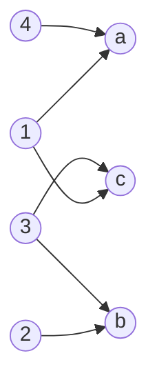
`1.1.2 Matrixschreibweise (Adjazenzmatrix)`
|$M$ \ $N$| a | b | c |
|--|--|--|--|
| 1 | 1 | 0 | 1 |
| 2 | 0 | 1 | 0 |
| 3 | 0 | 1 | 1 |
| 4 | 1 | 0 | 0 |


`1.1.3 vereinfachtes Pfeildiagramm`
*Pfeildiagramm kann vereinfacht werden, wenn die beiden Mengen **identisch** sind.*

*Beispiel: $R = \{(1,2); (1,5); (1,6); (2,2); (2,4)\}$ci
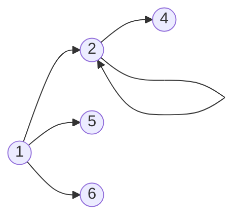
---
Anzahl der möglichen Paare einer Menge am Beispiel: 
$$
M=\{1;2;3;4;5;6\}
$$$$
|M| = 6
$$
- Anzahl der Paare von $M = 6 \times 6 = 36$
- Anzahl der Relationen von $M = 2^{36} \approx 64 Milliarden$, da alle Teilmengen von $M$ Relationen sind

> **Definition: Inverse Relationen**
> Wenn $R$ eine Relation mit $R \subseteq M \times N$ ist, dann ist die Inverse Relation $R^{-1} \subseteq N \times M$.
> $R^{-1} = \{(y,x) | (x,y) \in R\}$

_Beispiel für inverse Relationen:_
$R = \{(r,l) \in M \times M | r$ "ist Mutter von" $l\}$
$R^{-1} = \{(l,r) \in M \times M | l$ "hat als Mutter" $r\}$

> **Rechenregeln inverser Relationen**
> 1. $(R_1 \circ R_2)^{-1} = R_2^{-1} \circ R_1^{-1}$
> 2. $(R_1^{-1})^{-1} = R_1$

> **Definition: Verkettung (=Komposition) von Relationen**
> Die Verkettung von den Relationen $R_1 \subseteq A \times B$ und $R_2 \subseteq B \times C$ wird folgendermaßen dargestellt: $R_1 \circ R_2 = M_1 \times M_3$
> $$R_1 \circ R_2 = \{(a,c) | (a \in A) \land (c \in C) \land (\exist y \in B: ((a,b) \in R_1) \land ((b,c) \in R_2))$$

_Beispiel für verkettete Relationen:_
$R_1 = \{(l,r) |l$ "hat als Mutter" $r\}$
$R_2 = \{(r,e) | r$ "war verheitatet mit" $e\}$
$R_1 \circ R_2 = \{(l,e) | l$ "hat als Vater" $e\}$

> **Assoziativgesetz bei der Verkettung von Relationen**
> $$(R_1 \circ R_2) \circ R_3 = R_1 \circ (R_2 \circ R_3)$$

### 1.2 Eigenschaften von Relationen

| Eigenschaft | Definition |
|:--|:--|
| 1. **identische** Relation | $I=\{(x,x)$\| $x \in M\}$ |
| 2. **reflexive** Relation | $\forall x \in M: (x,x) \in R$ |
| 3. **irreflexive** Relation | $\forall x \in M: (x,x) \notin R$ |
| 4. **symmetrische** Relation | $\forall x,y \in M: (x,y) \in R \implies (y,x) \in R$ |
| 5. **asymmetrische** Realtion | $\forall x,y \in M: (x,y) \in R \implies (y,x) \notin R$ |
| 6. **antisymmetrische** Relation | $\forall x,y \in M: (x,y) \in R\land  (y,x) \in R \implies x = y$ |
| 7. **transitive** Relation | $\forall x,y,z \in M: (x,y) \in R \land (y,z) \in R \implies (x,z) \in R$ |

_Beispiele:_
1. _identische Relationen_
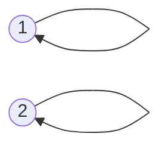
2. _reflexive Relationen_
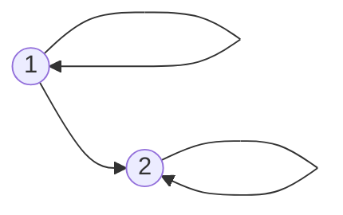
3. _irreflexive Relationen_
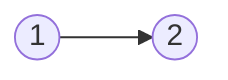
4. _symmetrische Relationen_ 

5. _asymmetrische Relationen_
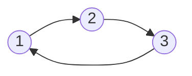
6. _antisymmetrische Relationen_

7. _transitive Relationen_ 
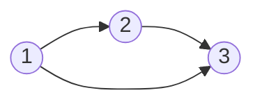

> **Zusammenhänge der Eigenschaften von Relationen**
> ```mermaid
> graph LR
> A((asymmetrisch)) --ist auch--> I((irreflexiv))
> I --ist nicht--> R((reflexiv))
> R --ist nicht--> I
> A --ist auch--> AN((antisymmetrisch))
> ```

> **Definition: Transitiv (reflexive) Hülle**
> Die **transitive Hülle** von der Relation $R$ wird gekennzeichnet durch $R^{+}$ und beinhaltet die Paare, die durch die Eigenschaft der Transitivität möglich werden.
> Die **reflexiv transitive Hülle** der Relation $R$ wird gekennzeichnet durch $R^{*}$ und beinhaltet zusätzlich zur transitiven Hülle die reflexiven Paare. Sie ist die kleinste transtitive und reflexive Relation, die $R$ umfasst.

_Beispiele_
_transitive Hülle (Praxisbeispiel: Organigramme in Unternehmen)_
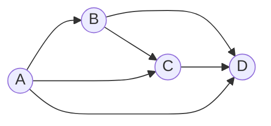
_reflexiv transitive Hülle_
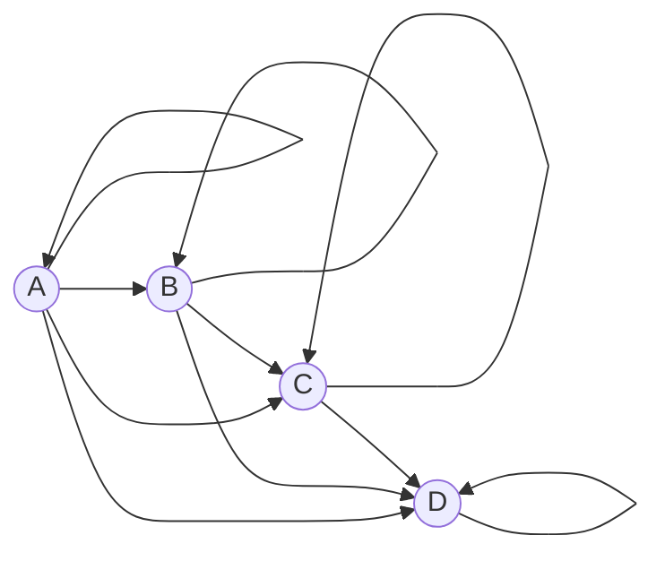
`Aufgaben dazu auf Seite 141f.`

### 1.3 Ordnungsrelationen 

> **Definition: (*strikte*) Ordnungsrelation**
> Die Ordnungsrelation ist eine Verallgemeinerung der "$\leq$"-Beziehung.
> Durch diese können Elemente einer Menge miteinander verglichen werden.
> 
> Eine **Ordnung** in $M$ existiert, wenn die Relation alle der folgenden Eigenschaften besitzt:
> -	reflexiv
> -	antisymmetrisch
> -	transitiv
> 
> Eine ***strikte* Ordnung** in $M$ existiert, wenn die Relation folgende Eigenschaften besitzt:
> -	asymmetrisch
> -	transitiv

*Beispiel einer Ordnungsrelation: Bsp. $\leq$*
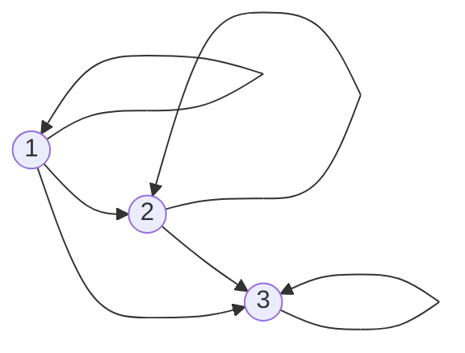
*Beispiel einer strikten Ordnungsrelation: Bsp. $\lt$*
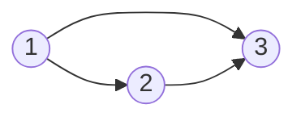

> **Definition: *totale* Ordnungsrelation**
> Bei einer ***totalen* Ordnungerelation** sind je zwei Elemente von $M$ bezüglich der Relation $R$ vergleichbar:
> $\forall x, y \in M: (x,y) \in R \lor (y,x) \in R$
>
> Sollte diese Eigenschaft nicht gegeben sein, spricht man von einer ***partiellen* Ordnung / Teilordnung**

*Beispiel: totale Ordnungsrelation*
Die Ordnungsrelation $\leq$ ist eine totale Ordnungsrelation in $\N$, da zwei Zahlen immer vergleichbar sind (5 $\leq$ 3 $\lor$ 3 $\leq$ 5).

*Beispiel: partielle Ordnungsrelation*
Die Ordnung "$:$" (geteilt durch) ist eine partielle Ordnungsrelation in $\N$, da die Relation $\frac{2}{3}$ oder $\frac{3}{2}$ in $\N$ nicht vergleichbar ist.

> **Definition: Nachbarschaftsrelation**
> Bei einer strikten Ordnungsrelation $\lt$ in $M$ ist die Nachbarschaftsrelation gegeben durch:
> $x \lt^{N} y \iff (x \lt y) \land (\nexists z \in M: (x \lt z) \land (z \lt y))$
> Es existiert kein Wert der Menge $M$ der zwischen die Werte $x$ und $y$ passt.

*Beispiel: Nachbarschaftrelation*
Strikte Ordnungsrelation $\lt$ in $\N: x = 3, y = 4$
$3 \lt^{N} 4 \iff (3 \lt 4) \land (\nexists z \in \N: (3 \lt z) \land (z \lt 4))$ - wahre Aussage
$3 \lt^{N} 5 \iff (3 \lt 5) \land (\nexists z \in \N: (3 \lt z) \land (z \lt 5))$ - falsche Aussage, da $z = 4$ existiert.

> **Hasse Diagramm**
> Das Hasse Diagramm ist eine grafische Darstellung in Form eines Pfeildiagramms der Nachbarschaftsrelation. (Reflexive und Transitive Verbindungen werden hierbei weggelassen)

*Beispiel: Hasse Diagramm*
Betrachtet wird die Nachbarschaftsrelation von der Menger aller **Teiler** von 70 $T_{70}=\{1, 2, 5, 7, 10, 14, 35, 70\}$

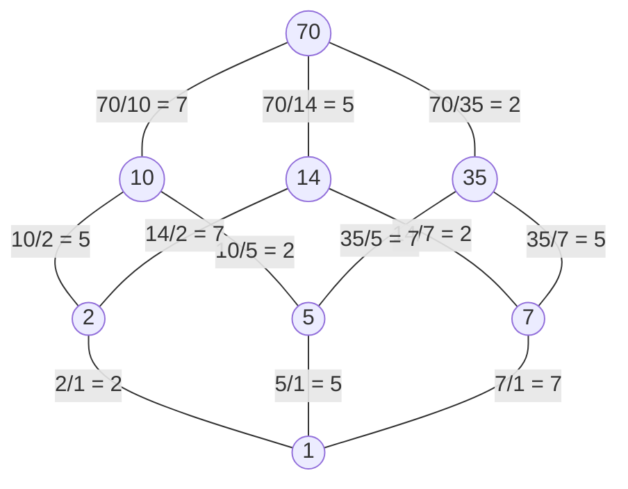

> **Informationserhaltungssatz für Hasse Diagramme**
> Wenn die Ordnungsrelation $\leq$ eine 
> -	**endliche Menge** ist, gilt: $(\leq^{N})^{*} = \leq$
> -	**beliebige Menge** ist, gilt: $(\leq^{N})^{*} \subseteq \leq$ 
> 
> Die Nachbarschaftsrelation ist also ausreichend zur Beschreibung der Ordnungsrelation, da mithilfe der transitiv-reflexiven Hülle dir Relation vollständig konstruiert werden kann.
> 
> *Für die Darstellung von Ordnungsrelationen in unendlichen Mengen (Bsp. $\R$) ist das Hasse Diagramm keine geeignete Darstellungsmethode, da hier ein Informationsverlust vorliegen kann*

### 1.4 Größte und Maximale Elemente, obere Schranken und Suprema

> **Definition: Größte - und Maximale Elemente**
> Sei $\leq$ eine Ordnungsrelation in $M$.
> **Größtes Element:**
> $größtesElement \in M \land \forall x \in M: x \leq größtesElement$ 
> 
> Eigenschaften:
> -	Größtes Element $\in M$
> -	Größtes Element ist mit allen Elementen aus $M$ vergleichbar
> -	Beim Vergleich zu den anderen Elementen in $M$, ist das größte Element $\leq$ alle anderen Elemente der Menge.
> -	Es gibt maximal ein größtes Element der Menge $M$
> -	Jedes größte Element ist auch ein maximales Element
> 
> **Maximales Element**
> $maximalesElement \in M \land \forall x \in M: maximalesElement \leq x \implies x = maximales Element$
> Eigenschaften:
> -	Maximales Element $\in M$
> -	Es ist nicht unbedingt mit allen Elementen vergleichbar
> -	Wenn es vergleichbar ist, dann ist es das größere

*Beispiel: $M=\{1,2,3,4,5,6,7,8\}, R=/$*
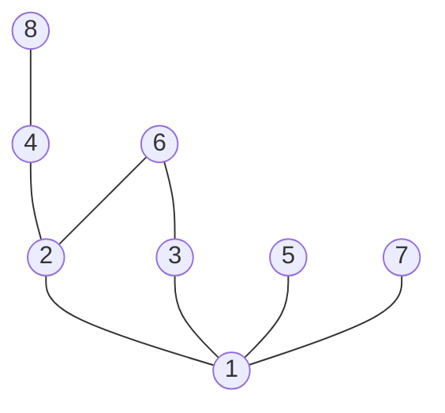
| Teilmenge | maximale Elemente | größtes Elemente |
|--|--|--|
| $\{2,3,6\}$ | $\{6\}$ | 6 |
| $\{2,3\}$ | $\{2,3\}$ | $\{\}$ |
| $\{2,3,5,6\}$ | $\{5,6\}$ | $\{\}$ |
| $\{1,2,3,4,5,6,7,8\}$ | $\{5,6,7,8\}$ | $\{\}$ |

> **Definition: Supremum / Infimum**
> Ordnungsrelation $\leq$ in $M$ mit $T \subseteq M$
> 1.	$obereSchranke \in M$ von $T: \forall x \in T: x \leq obereSchranke$
>
> 2.	$untereSchranke \in M$ von $T: \forall x \in T: untereSchranke \leq x$
>
> 3.	$obereGrenze \in M$ von $T$ ist definiert durch das minimale Element der oberen Schranken
>
> 4.	$untereGrenze \in M$ von $T$ ist definiert durch das maximale Element der unteren Schranken
>
> 5.	$Supremum$ ist definiert durch das kleinste Element der Menge der oberen Schranken.
>
> 6.	$Infimum$ ist definiert durch das größte Element der Menge der unteren Schranken. 

*Beispiel: Supremum / Infimum*
| Teilmenge | Infimum | Supremum | minimalste Element | maximale Element |
|--|--|--|--|--|
| $\{2,3,6\}$ | $2$ | $6$ | $2$ | $6$ |
| $[0,8)\in \R$ | $0$ | $8$ | 0 | $\{\}$ |

*Beispiel: Obere Grenze:*
$\{3,4\} \in \{1,2,3,4,5,6,7\}$
-	Obere Schranken: $\{5,6,7\}$
-	Obere Grenze: $\{5,6\}$
-	kein Supremum

> **Definition: Existenzsatz Supremum**
> Eine Menge hat ein Supremum, wenn sie **nur eine** obere Grenze hat.
> 
> **Definition: Existenzsatz Infimum**
> Eine Menge hat ein Infimum, wenn sie **nur eine** untere Grenze hat.

`Beweis zur Übung: S. 156`


### 1.5 Verbände

> **Definition: Verband**
> Zu zwei Elementen $a,b\in M$ existiert das $Supremum$ und das $Infimum$:
> $a \sqcup b = sup\{a,b\}$
> $a \sqcap b = inf\{a,b\}$

### 1.6 Äquivalenzrelationen

> **Definition: Äquivalenzrelation**
> $R$ heißt Aquivalenzrelation, wenn
> -	$R$ ist reflexiv
> -	$R$ ist symmetrisch
> -	$R$ ist transitiv
> 
> Äquivalenzrelationen werden auch durch $\equiv$ dargestellt.

> **Definition: Äquivalenzklasse**
> Jedes Element der Äquivalenzrelation in $M$ ist in der Äquivalenzklasse $[x]$
> $[x] = \{y \in M: y \equiv x\}$

> **Eigenschaften von Äquivalenzklassen**
> 1.	Reflexivität: $x \in [x]$
> 2.	Symmetrie: $y \in [x] \implies x\in [y]$
> 3.	Transitivität: $(x \in [y] \land y \in [z]) \implies x \in [z]$
> 
> Außerdem gilt:
> Die Menge der Äquivalenzklassen von $M$ ergibt zusammengenommen die ganze Menge $M$. 
> $$\bigcup_{x \in M} [x] = M$$

### 1.7 Restklassen

> **Definition: Kongruenz modulo m**
> Zwei natürlichen Zahlen sind **kongruent modulo m** oder $\equiv_{m}$, wenn sie bei der Division durch die natürliche Zahl $m$ denselben Rest $r$ lassen.
> Hierbei entsteht folgende Äquivalenzrelation: $\equiv_{m} \subseteq \Z \times \Z$
> Die Aquivalenzklassen der Relation heißen **Restklassen modulo m**.

*Beispiele: Kongruenz modulo m*
-	Äquivalenzklassen von $\equiv_{2}$ sind gerade und ungerade Zahlen.
	-	ungerade zahlen $[1]_2$
	-	gerade Zahlen $[2]_2$
-	Äquivalenzklassen von $\equiv_{10}$
	-	$[0]_{10} = \{0, 10, 20, ...\}$
	-	$[1]_{10} = \{1, 11, 21, ...\}$
	-	$[2]_{10} = \{2, 12, 22, ...\}$
	-	$[3]_{10} = \{3, 13, 23, ...\}$
	-	$[4]_{10} = \{4, 14, 24, ...\}$
	-	$[5]_{10} = \{5, 15, 25, ...\}$
	-	$[6]_{10} = \{6, 16, 26, ...\}$
	-	$[7]_{10} = \{7, 17, 27, ...\}$
	-	$[8]_{10} = \{8, 18, 28, ...\}$
	-	$[9]_{10} = \{9, 19, 29, ...\}$

### 1.8 Abbildungen

> **Definition: Abbildung**
> Eine Abbildung beschreibt die Zuordnung von der Quell- zur Zielmenge.
> **Eigenschaften einer Abbildung**
> 1.	Existenz
> 2.	Eindeutigkeit

> **Definition: Links- / Rechtseindeutigkeit**
> **Linkseindeutigkeit**
> -	Jeder Punkt in der Zielmenge wird **max.** einmal aus der Quellmenge getroffen.
> -	Jedem Punkt in der Zielmenge ist **eindeutig** einem Punkt der Quellmenge zuzuordnen.
> $$\forall x,y \in A: \forall z \in B: (x,z) \in R \land (y,z) \in R \implies x = y$$
> 
> **Rechtseindeutigkeit**
> -	Jeder Punkt in der Quellmenge wird **max.** einmal aus der Zielmenge getroffen.
> -	Jedem Punkt in der Quellmenge ist **eindeutig** einem Punkt der Zielmenge zuzuordnen.
> $$\forall x,y \in B: \forall z \in A: (z,x) \in R \land (z,y) \in R \implies x = y$$
> 
> **Eigenschaften**
> -	Bei inversen Relationen $(R^{-1})$ wird die Eindeutigkeit umgedreht.
> *Beispielt: linkseindeutige Relation* $R \rightarrow$ *rechtseindeutige Relation* $R^{-1}$
> -	Bei Verkettung bleiben die Eigenschaften erhalten.
> *Beispiel: linkseindeutige Relationen* $R_1, R_2 \rightarrow R_1 \circ R_2$ bleibt linkseindeutig

*Beispiel Links-/Rechtseindeutigkeit:*
*Linkseindeutigkeit:*
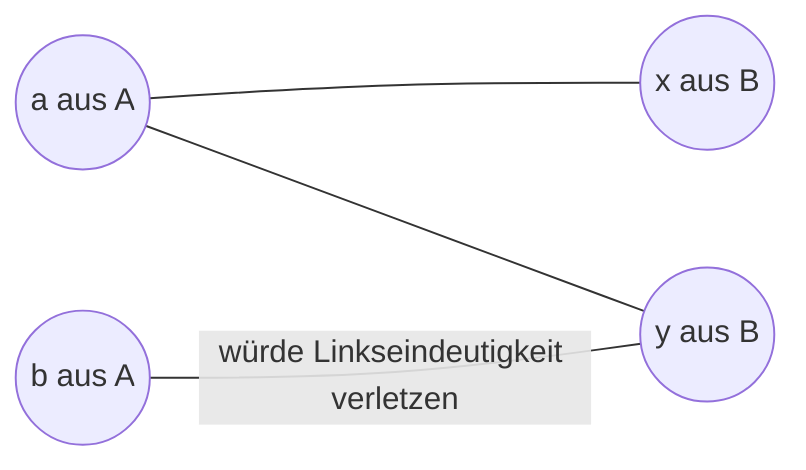

*Rechtseindeutigkeit:*
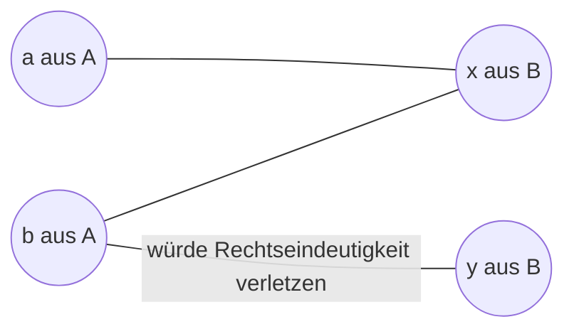

> **Definition: Links- und Rechtstotalität**
> **Linkstotalität**
> $\forall x \in A: \exists y \in B: (x,y) \in R$
> 
> **Rechtstotalität**
> $\forall y \in B: \exists x \in A: (x,y) \in R$
> 
> **Eigenschaften**
> -	Bei inversen Relationen $(R^{-1})$ wird die Totalität umgedreht.
> *Beispielt: linkstotale Relation* $R \rightarrow$ *rechtstotale Relation* $R^{-1}$
> -	Bei Verkettung bleiben die Eigenschaften erhalten.
> *Beispiel: linkstotale Relationen* $R_1, R_2 \rightarrow R_1 \circ R_2$ bleibt linkstotal

*Beispiel Links-/Rechtstotalität:*
*Linkstotalität*
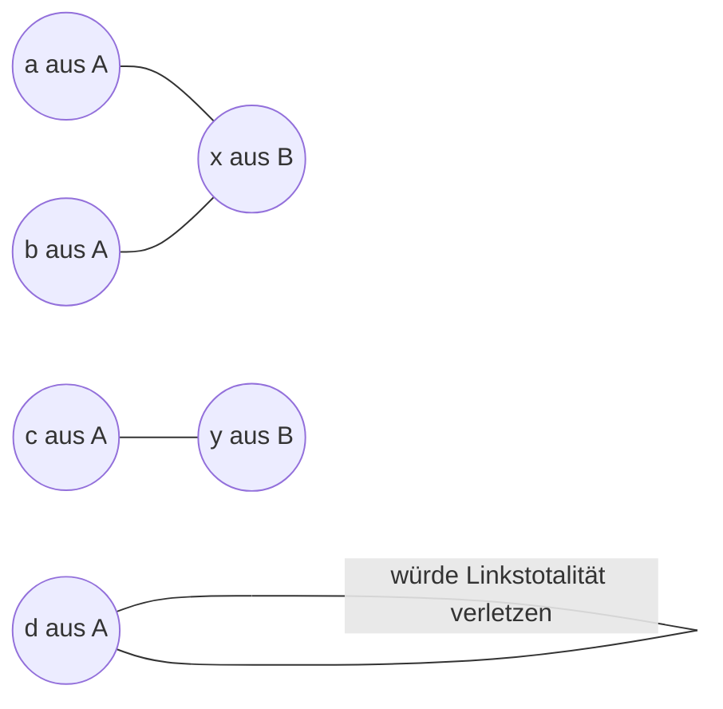

*Rechtstotalität*
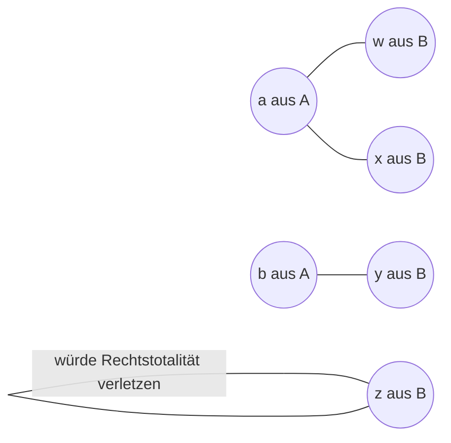
> **Definition: Abbildung**
> Eine Relation heißt Abbildung oder Funktion, wenn sie 
> - **rechtseindeutig** und  (= Jeder X-Wert hat nur einen einzigen zugehörigen Y-Wert)
> - **linkstotal** ist. (= Jeder X-Wert hat einen Y-Wert)
> 
> Zu jedem $x \in A$ existiert **genau ein** $y \in B$, sodass $(x,y) \in R$
> 
> Schreibweise für eine Abbildung $R$ von $A$ nach $B$: $R: A \rightarrow B$
> 
> $A$ ist hierbei der Definitionsbereich oder auch Quellmenge
> $B$ ist hierbei das Bild oder auch Zielmenge

*Beispiel: Abbildung anhand der Funktion* $f(x) = 2x$
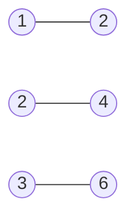
*weitere Abbildung*
``` mermaid
graph RL
x((x)) --- a((a))
y((y)) --- b((b))
y --- c((c))
z((z))
```

> **Eigenschaften von Abbildungen**
> - **surjektiv**, wenn die Abbildung rechtstotal ist (= Jedem Y-Wert ist ein X-Wert zugeordnet)
> - **injektiv**, wenn die Abbildung linkseindeutig ist (= Jedem Y-Wert kann genau ein X-Wert zugeordnet werden Bsp. $f(x) = 2x$)
> - **bijektiv**, wenn die Abbildung linkseindeutig und rechtstotal ist


## 2. Algebraische Strukturen

### 2.1 Verknüpfungen

> **Definition: Verknüpfung**
> Die Verknüpfung einer nichtleeren Menge ist eine Abbildung.
> Das Ergebnis zweier verknüpfter Elemente wird dargestellt durch $x \circ y$
> 
> Das Paar $(M, \circ)$ wird algebraische Struktur genannt.

> **Kommutativgesetz**
> Eine algebraische Struktur ist kommutativ, falls 
> $\forall x,y \in M: x \circ y = y \circ x$
> 
> **Assoziativgesetz**
> Eine algebraische Struktur ist assoziativ, falls
> $\forall x,y,z \in M: (x \circ y) \circ z = x \circ (y \circ z)$

*Beispiele für algebraische Strukturen:*
-	Addition von natürlichen Zahlen: $(\N, +)$ [kommutativ und assoziativ]
-	Addition von ganzen Zahlen: $(\Z, +)$ [kommutativ und assoziativ]
-	Subtraktion von ganzen Zahlen: $(\Z, -)$ [nicht kommutativ und nicht assoziativ]

```
Bemerkung: Die Subtraktion von natürlichen Zahlen ist keine algebraische Struktur,
da bei negativen Ergebnissen der Bereich der narütlichen Zahlen verlassen wird
```

**Darstellungsform: Verknüpfungstafel**
*Beispiel: algebraische Struktur* $(\{1,2,3\}, +)$
| + | 1 | 2 | 3 |
|:--:|--|--|--|
| **1** | 2 | *3* | *4* |
| **2** | *3* | 4 | *5* |
| **3** | *4* | *5* | 6 |

```
Bemerkung: Die algebraische Struktur ist kommutativ, 
wenn die Verknüpfungstafel an der Diagonalen (hier 2,4,6) symmetrisch ist.
```
> **Existenzsatz**
> $\forall a,b \in M: \exists x \in M: a \circ x = b$
> 
> Angewendet auf die Verknüpfungstafel: Jedes Element kommt in jeder Zeile der Tabelle mind. einmal vor. (Bei $... x \circ a = b)$ kommt jedes Element in jeder Spalte mind. einmal vor.
> 
> **Eindeutigkeitssatz**
> $\forall a,b \in M: \forall x,y \in M: (a \circ x = b) \land (a \circ y = b) \implies x = y$
> 
> Angewendet auf die Verknüpfungstafel: Jedes Element kommt in jeder Zeile der Tabelle max. einmal vor. (Bei $... x \circ a = b \land y \circ a = b ...)$ kommt jedes Element in jeder Spalte max. einmal vor.


*Beispiel: Existenzsatz*
-   $(\Z, +)$: Existenzsatz gilt	
-	$(\N, +)$: Existenzsatz gilt nicht. Bsp. a = 20, b = 10

*Angewendet auf die Verknüpfungstafel:*
| $(\{-2, -1, 0, 1, 2\}, +)$ | -2 | -1 | 0 | 1 | 2 |
|:--:|--|--|--|--|--|
| **-2** | -4 | -3 | *-2* | *-1* | *0* |
| **-1** | -3 | *-2* | *-1* | *0* | *1* |
| **0** | *-2* | *-1* | *0* | *1* | *2* |
| **1** | *-1* | *0* | *1* | *2* | 3 |
| **2** | *0* | *1* | *2* | 3 | 4 |

*Beispiel: Eindeutigkeitssatz*
-	$(\N, +)$: Eindeutigkeitssatz gilt
-	$(\Z, *)$: Eindeutigkeitssatz gilt nicht. Bsp. $4*5 = 20$ und $2* 10 = 20$

*Angewendet auf die Verknüpfungstafel*
| $(\{1,2,3\}, +)$ | 1 | 2 | 3 |
|:--:|--|--|--|
| **1** | *2* | *3* | 4 |
| **2** | *3* | 4 | 5 |
| **3** | 4 | 5 | 6 |

> **Definition: Endliche Algebraische Strukturen**
> Eine endliche algebraische Struktur existiert, wenn Endlichkeit und Existenz gleichwertig sind.

`Seite 176 - Aufgaben`

### 2.2 Restklassenoperationen

> **Definition: Restklassenoperationen**
> **Restklassenaddition**
> $[a]_m \oplus [b]_m = [a + b]_m$
> 
> **Restklassenmultiplikation**
> $[a]_m \otimes [b]_m = [a * b]_m$

> **Unabhängigkeit vom Repräsentanten**
> Eigenschaften von Äquivalenzklassen, die anhand eines Repräsentanten festgelegt werden müssen bewiesen werden, dass die unabhängig vom Repräsentanten gelten.

*Beispiel: Beweis Unabhängigkeit vom Repräsentanten*
zu beweisen: $(\Z /m, \oplus)$
gegeben: $a,b, x, y \in \Z$ mit $[a]_m = [b]_m \land [x]_m = [y]_m$
zu zeigen: $[a+b]_m = [x+y]_m$
nach Voraussetzung: $o, p \in \Z$, so dass $a-x = o*m$ und $b-y = p*m$
dann gilt: 
$a + b - (x - y)$
$= a - x + b - y$
$= o * m + p * m$
$= m (o + p)$

```
Bemerkung: Rechnen mit Restklassenoperationen kann durch 
die korrekte Wahl des Repräsentanten vereinfacht werden.

Außerdem können bei Unabhängigkeit des Repräsentanten 
Kommutativ- und Assoziativgesetze angewendet werden.

Ab Seite 180. Aufgaben
```

### 2.3 Gruppen

> **Definition: Gruppe**
> Eine algebraische Struktur heißt Gruppe $G$, wenn folgendes gilt:
> -	Assoziativität
> -	Es gibt ein neutrales Element e der Gruppe mit	
>      - linksneutralem Element: $\forall a \in G: e \circ a = a$
>      - linksinversem Element: $\forall a \in G: \exists b \in G: b \circ a = e$
>      
> $oder$
> -	Assoziativität
> -	Existenzsatz der algebraischen Struktur

> **Definition: Abelsche Gruppe**
> Eine Abelsche Gruppe hat zur Gruppe die zusätzliche Definition der Kommutativität. In diesem Fall wird $+$ anstatt von $\circ$ verwendet.

*Beispiel Neutrale und Inverse Elemente:*
-	Neutrales Element der Addition: **0** (Bsp. $5 + 0 = 5$)
-	Neutrales Element der Multiplikation: **1** (Bsp. $5 * 1 = 5$)
-	Inverses Element der Addition: Element $a$, Inverses- $-a$ (Bsp. $5 - 5 = 0$
-	Inverses Element der Multiplikation: Element $a$, Inverses- $a^{-1}$ oder $\frac1a$

`Bemerkung: Es gibt genau ein Neutrales Element.`


> **Eindeutigkeit der Lösbarkeit von einer Gruppe**
> Für jede Gruppe gilt der Eindeutigkeitssatz. D.h. es gibt für jedes $a,b \in G$ höchstens eine Lösung $c \in G$ der Gleichung $a \circ c = b$

> **Ordnung einer Gruppe**
> Als Ordnung einer Gruppe wird die Anzahl der Elemente definiert.
> $$|G|$$

*Beispiel zur Ordnung einer Gruppe:*
$|(\{1,2,3\}, +)| = 3$


### 2.4 Restklassengruppen mit Multiplikation

*Beispiel: ggT durch Primfaktorzerlegung - ggT(240,420)*
240 = 2 * 2 * (2 * 2 * 3 * 5)
420 = (2 * 2 * 3 * 5) * 7
ggT(240,420) = 2 * 2 * 3 * 5 = 60

> **Definition: "div" und "mod"**
> $a = q * b + r$
> $q = a \: div \: b$ `Quotient der Division`
> $r = a \: mod \: b$ `Rest der Division`

*Beispiel: a = 68, b = 10*
$q = \frac{68}{10} = 6$
$r = 68 \: mod \: 10 = 8$
$68 = 6 * 10 + 8$

> **gemeinsame Teiler**
> $a = q * b + r$
> Die Menge $gT(a,b)$ der gemeinsamen Teiler ist gleich der Menge $gT(b,r)$
> Am Beispiel von oben: $gT(68, 10) = \{2\} = gT(10, 8)$

> **Euklidischer Algorithmus**
> Algorithmus zur Berechnung des $ggT$ zweier positiver ganzer Zahlen $a$ und $b$
> $ggT(a, b): (a > b)$ 
> $a = q * b + r_1$
> $b = q * r_1 + r_2$
> $r_1 = q * r_2 + r_3$
> $...$
> $r_{n-1} = q * r_n + 0$
> $ggT(a,b) = r_n$
> `Bemerkung: q ist der Quotient und Zeilenunabhängig`

> **Definition: Satz von Bézout**
> Für $a, b$ gibt es ein $a^{*} \in \N$ und $b^{*} \in \Z$, mit:
> $$a^{*}*a + b^{*} * b = ggT(a,b)$$

*Beispiel: Satz von Bézout:*

$a = 17, b = 5$
$ggT(17,5) = 1$
$a^{*} \in \N = 3$
$b^{*} \in \Z = -10$
$a^{*} * a + b^{*}*b = 3 * 17 + (- 10 * 5) = 1 = ggT(17,5)$

> **Existenzsatz: Multiplikative Inverse Restklasse**
> Eine Restklasse $[a]_m$ besitzt nach dem Satz von Bézout ein multiplikatives Inverses $[a^{*}]_m$:
> $$[a]_m \otimes [a^{*}]_m = [1]_m$$

*Beispiel: Multiplikatives Inverse*
$[3]_5 \otimes [2]_5 = [1]_5$
$[2]_5$ ist die multiplikativ Inverse Restklasse zu $[3]_5$.

>**Multiplikative Restklassengruppe**
> Wenn der modulo eine Primzahl ist, dann ist $\Z / m$ \ $\{[0]_m\}$ eine Gruppe.

>**Existenzsatz: Restklassengleichung**
> Wenn der $ggT(a,m)$ durch $b$ teilbar ist, gilt folgende Gleichung:
> $$[a]_m \otimes [x]_m = [b]_m$$

>**Vorgehen:**
> 1. Euklid-Algorithmus
> 2. ggT(a,m) teilt b
> 3. Wenn nein $\rightarrow$ keine Lösung
> Wenn ja $\rightarrow$ eine oder mehrere Lösungen
> 4. Euklid-Algorithmus rückwärts
> 5. Ergebnis mit $ \frac{3}{3} dd {b}{ggT(a,m)} $

*Beispiel: Restklassengleichung*
$ggT(4,12) = 4$

$[4]_{12} \otimes [x]_{12} = [3]_{12}$
$4$ ist kein Teiler von $3 \rightarrow$ es gibt keine Lösung für die obige Gleichung.

$[4]_{12} \otimes [x]_{12} = [8]_{12}$
$4$ ist Teiler von 8, da 8 ein Vielfaches vom $ggT(4,12) = 4$ ist ist $\rightarrow$ die obige Gleichung besitzt Lösungen:
Berechnung der Lösung:
1. Euklid-Algorithmus vorwärts: (evtl. einen höheren Repräsentanten wählen)
$[4]_{12} = [16]_{12}$
$16 = 1 * 12 + 4$ `hier für Euklid-Algorithmus rückwärts einsteigen`
$12 = 3 * 4 + 0$

2. Euklid-Alorithmus rückwärts:
$4 = 16$ **- 1** $* 12$
$[-1]_{12} = [11]_{12}$
Daher ist das multiplikative Inverse von $[4]_{12}$ die Restklasse $[-1]_{12} = [11]_{12}$.
3. Multiplikator für das gesuchte $x$ identifizieren:
$b = 8, ggT(a,m) = 4 \implies \frac{8}{4} = 2$
4. Lösung finden:
$x = (Multiplikator * ) \: mod \: m = (2 * 11) \: mod \: 12 = $

Ergebnis: $[4]_{12} \otimes [11]_{12} = [8]_{12}$

### 2.5 Untergruppen


### 2.6 Isomorphismen

<!--stackedit_data:
eyJoaXN0b3J5IjpbODgyNjgwMTI4LC0xNDg4OTYxMDI5LC0xMD
M0NTQwNDIwLDY2MTYyMzgwLC0xNTA0OTg2MzY3LC0xMTM2MDgw
MTA0LDE2MDIyMzU1NDYsLTEzNDc2NTE2OTMsLTE3MjE3Njg0Nj
MsLTQzNTMyNjYzNywxNjgxMzE2Mjk4LC0xMzQ0NjM4Mjk2LDE2
ODEzMTYyOTgsLTE0Mjc5NDI0MDIsMTU5NTU0NTMxMywtMTgyMD
QwOTMxOCwxMzU5MDE2OTI5LDczMzY0NzczNCwtNzY1OTkxMTY0
LC0xMTcyNjg5MDU4XX0=
-->