# Diskrete Mathematik 2

## 1.  Relationen
### 1.1 Allgemeine Relationen und deren Darstellung

-	Relationen stellen Beziehungen zwischen Objekten dar
-	kann zur Beschreibung von Ordnungen und Äquivalenzen genutzt werden
-	Relation ist eine Menge

> **Definition: Relation**
> Eine binäre Relation zwischen zwei Mengen ist eine Teilmenge des kartesischen Produkts:
> $R \subseteq M \times N$
> Für die Paare $(x,y) \in R$ gilt: $x$ steht in Relation zu $y$ (auch $x R y$)

#### Darstellung von Relationen
*Beispiel: $R = \{(1,a); (1,c); (2,b); (3,b); (3,c); (4,a)\}$*

`1.1.1 Pfeildiagramme`
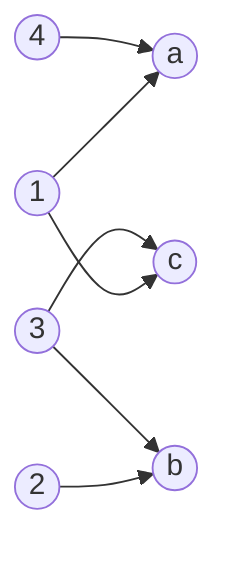
`1.1.2 Matrixschreibweise (Adjazenzmatrix)`
|$M$ \ $N$| a | b | c |
|--|--|--|--|
| 1 | 1 | 0 | 1 |
| 2 | 0 | 1 | 0 |
| 3 | 0 | 1 | 1 |
| 4 | 1 | 0 | 0 |


`1.1.3 vereinfachtes Pfeildiagramm`
*Pfeildiagramm kann vereinfacht werden, wenn die beiden Mengen **identisch** sind.*

*Beispiel: $R = \{(1,2); (1,5); (1,6); (2,2); (2,4)\}$ci
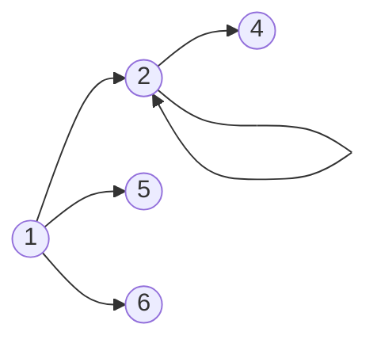
---
Anzahl der möglichen Paare einer Menge am Beispiel: 
$$
M=\{1;2;3;4;5;6\}
$$$$
|M| = 6
$$
- Anzahl der Paare von $M = 6 \times 6 = 36$
- Anzahl der Relationen von $M = 2^{36} \approx 64 Milliarden$, da alle Teilmengen von $M$ Relationen sind

> **Definition: Inverse Relationen**
> Wenn $R$ eine Relation mit $R \subseteq M \times N$ ist, dann ist die Inverse Relation $R^{-1} \subseteq N \times M$.
> $R^{-1} = \{(y,x) | (x,y) \in R\}$

_Beispiel für inverse Relationen:_
$R = \{(r,l) \in M \times M | r$ "ist Mutter von" $l\}$
$R^{-1} = \{(l,r) \in M \times M | l$ "hat als Mutter" $r\}$

> **Rechenregeln inverser Relationen**
> 1. $(R_1 \circ R_2)^{-1} = R_2^{-1} \circ R_1^{-1}$
> 2. $(R_1^{-1})^{-1} = R_1$

> **Definition: Verkettung (=Komposition) von Relationen**
> Die Verkettung von den Relationen $R_1 \subseteq A \times B$ und $R_2 \subseteq B \times C$ wird folgendermaßen dargestellt: $R_1 \circ R_2 = M_1 \times M_3$
> $$R_1 \circ R_2 = \{(a,c) | (a \in A) \land (c \in C) \land (\exist y \in B: ((a,b) \in R_1) \land ((b,c) \in R_2))$$

_Beispiel für verkettete Relationen:_
$R_1 = \{(l,r) |l$ "hat als Mutter" $r\}$
$R_2 = \{(r,e) | r$ "war verheitatet mit" $e\}$
$R_1 \circ R_2 = \{(l,e) | l$ "hat als Vater" $e\}$

> **Assoziativgesetz bei der Verkettung von Relationen**
> $$(R_1 \circ R_2) \circ R_3 = R_1 \circ (R_2 \circ R_3)$$

### 1.2 Eigenschaften von Relationen

| Eigenschaft | Definition |
|:--|:--|
| 1. **identische** Relation | $I=\{(x,x)$\| $x \in M\}$ |
| 2. **reflexive** Relation | $\forall x \in M: (x,x) \in R$ |
| 3. **irreflexive** Relation | $\forall x \in M: (x,x) \notin R$ |
| 4. **symmetrische** Relation | $\forall x,y \in M: (x,y) \in R \implies (y,x) \in R$ |
| 5. **asymmetrische** Realtion | $\forall x,y \in M: (x,y) \in R \implies (y,x) \notin R$ |
| 6. **antisymmetrische** Relation | $\forall x,y \in M: (x,y) \in R\land  (y,x) \in R \implies x = y$ |
| 7. **transitive** Relation | $\forall x,y,z \in M: (x,y) \in R \land (y,z) \in R \implies (x,z) \in R$ |

_Beispiele:_
1. _identische Relationen_
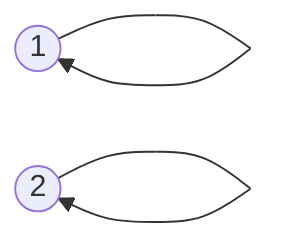
2. _reflexive Relationen_
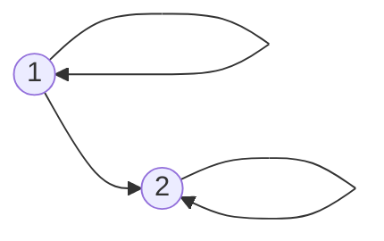
3. _irreflexive Relationen_
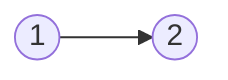
4. _symmetrische Relationen_ 

5. _asymmetrische Relationen_
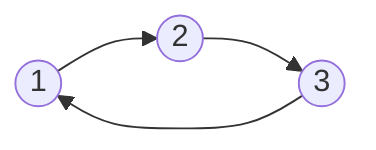
6. _antisymmetrische Relationen_

7. _transitive Relationen_ 
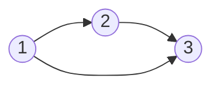

> **Zusammenhänge der Eigenschaften von Relationen**
> ```mermaid
> graph LR
> A((asymmetrisch)) --ist auch--> I((irreflexiv))
> I --ist nicht--> R((reflexiv))
> R --ist nicht--> I
> A --ist auch--> AN((antisymmetrisch))
> ```

> **Definition: Transitiv (reflexive) Hülle**
> Die **transitive Hülle** von der Relation $R$ wird gekennzeichnet durch $R^{+}$ und beinhaltet die Paare, die durch die Eigenschaft der Transitivität möglich werden.
> Die **reflexiv transitive Hülle** der Relation $R$ wird gekennzeichnet durch $R^{*}$ und beinhaltet zusätzlich zur transitiven Hülle die reflexiven Paare. Sie ist die kleinste transtitive und reflexive Relation, die $R$ umfasst.

_Beispiele_
_transitive Hülle (Praxisbeispiel: Organigramme in Unternehmen)_
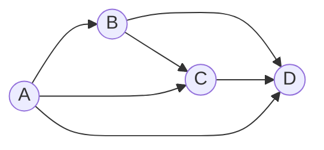
_reflexiv transitive Hülle_
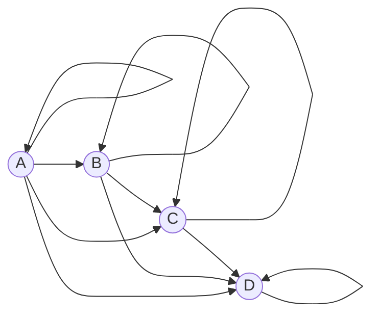
`Aufgaben dazu auf Seite 141f.`

### 1.3 Ordnungsrelationen 

> **Definition: (*strikte*) Ordnungsrelation**
> Die Ordnungsrelation ist eine Verallgemeinerung der "$\leq$"-Beziehung.
> Durch diese können Elemente einer Menge miteinander verglichen werden.
> 
> Eine **Ordnung** in $M$ existiert, wenn die Relation alle der folgenden Eigenschaften besitzt:
> -	reflexiv
> -	antisymmetrisch
> -	transitiv
> 
> Eine ***strikte* Ordnung** in $M$ existiert, wenn die Relation folgende Eigenschaften besitzt:
> -	asymmetrisch
> -	transitiv

*Beispiel einer Ordnungsrelation: Bsp. $\leq$*
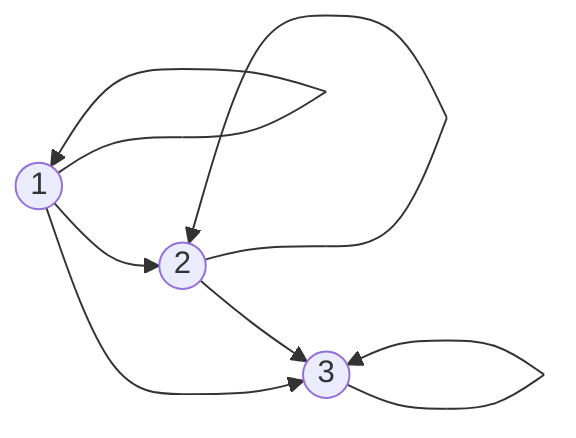
*Beispiel einer strikten Ordnungsrelation: Bsp. $\lt$*
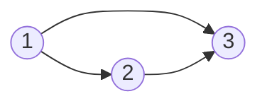

> **Definition: *totale* Ordnungsrelation**
> Bei einer ***totalen* Ordnungerelation** sind je zwei Elemente von $M$ bezüglich der Relation $R$ vergleichbar:
> $\forall x, y \in M: (x,y) \in R \lor (y,x) \in R$
>
> Sollte diese Eigenschaft nicht gegeben sein, spricht man von einer ***partiellen* Ordnung / Teilordnung**

*Beispiel: totale Ordnungsrelation*
Die Ordnungsrelation $\leq$ ist eine totale Ordnungsrelation in $\N$, da zwei Zahlen immer vergleichbar sind (5 $\leq$ 3 $\lor$ 3 $\leq$ 5).

*Beispiel: partielle Ordnungsrelation*
Die Ordnung "$:$" (geteilt durch) ist eine partielle Ordnungsrelation in $\N$, da die Relation $\frac{2}{3}$ oder $\frac{3}{2}$ in $\N$ nicht vergleichbar ist.

> **Definition: Nachbarschaftsrelation**
> Bei einer strikten Ordnungsrelation $\lt$ in $M$ ist die Nachbarschaftsrelation gegeben durch:
> $x \lt^{N} y \iff (x \lt y) \land (\nexists z \in M: (x \lt z) \land (z \lt y))$
> Es existiert kein Wert der Menge $M$ der zwischen die Werte $x$ und $y$ passt.

*Beispiel: Nachbarschaftrelation*
Strikte Ordnungsrelation $\lt$ in $\N: x = 3, y = 4$
$3 \lt^{N} 4 \iff (3 \lt 4) \land (\nexists z \in \N: (3 \lt z) \land (z \lt 4))$ - wahre Aussage
$3 \lt^{N} 5 \iff (3 \lt 5) \land (\nexists z \in \N: (3 \lt z) \land (z \lt 5))$ - falsche Aussage, da $z = 4$ existiert.

> **Hasse Diagramm**
> Das Hasse Diagramm ist eine grafische Darstellung in Form eines Pfeildiagramms der Nachbarschaftsrelation. (Reflexive und Transitive Verbindungen werden hierbei weggelassen)

*Beispiel: Hasse Diagramm*
Betrachtet wird die Nachbarschaftsrelation von der Menger aller **Teiler** von 70 $T_{70}=\{1, 2, 5, 7, 10, 14, 35, 70\}$

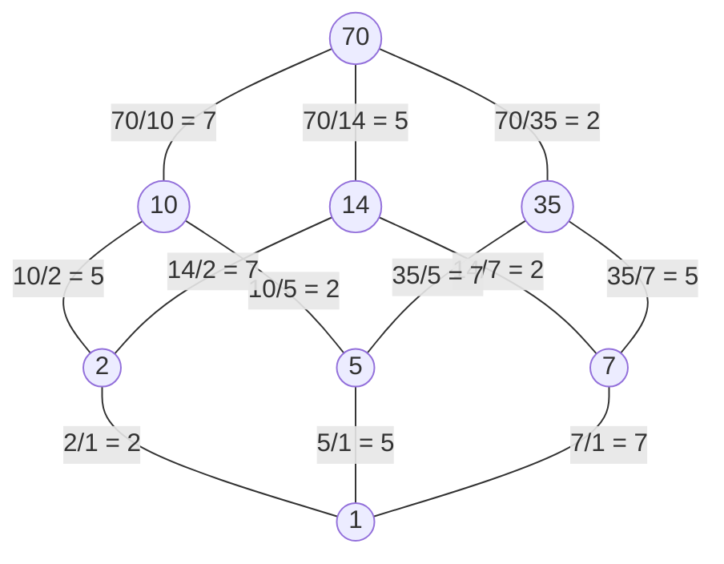

> **Informationserhaltungssatz für Hasse Diagramme**
> Wenn die Ordnungsrelation $\leq$ eine 
> -	**endliche Menge** ist, gilt: $(\leq^{N})^{*} = \leq$
> -	**beliebige Menge** ist, gilt: $(\leq^{N})^{*} \subseteq \leq$ 
> 
> Die Nachbarschaftsrelation ist also ausreichend zur Beschreibung der Ordnungsrelation, da mithilfe der transitiv-reflexiven Hülle dir Relation vollständig konstruiert werden kann.
> 
> *Für die Darstellung von Ordnungsrelationen in unendlichen Mengen (Bsp. $\R$) ist das Hasse Diagramm keine geeignete Darstellungsmethode, da hier ein Informationsverlust vorliegen kann*

### 1.4 Größte und Maximale Elemente, obere Schranken und Suprema

> **Definition: Größte - und Maximale Elemente**
> Sei $\leq$ eine Ordnungsrelation in $M$.
> **Größtes Element:**
> $größtesElement \in M \land \forall x \in M: x \leq größtesElement$ 
> 
> Eigenschaften:
> -	Größtes Element $\in M$
> -	Größtes Element ist mit allen Elementen aus $M$ vergleichbar
> -	Beim Vergleich zu den anderen Elementen in $M$, ist das größte Element $\leq$ alle anderen Elemente der Menge.
> -	Es gibt maximal ein größtes Element der Menge $M$
> -	Jedes größte Element ist auch ein maximales Element
> 
> **Maximales Element**
> $maximalesElement \in M \land \forall x \in M: maximalesElement \leq x \implies x = maximales Element$
> Eigenschaften:
> -	Maximales Element $\in M$
> -	Es ist nicht unbedingt mit allen Elementen vergleichbar
> -	Wenn es vergleichbar ist, dann ist es das größere

*Beispiel: $M=\{1,2,3,4,5,6,7,8\}, R=/$*
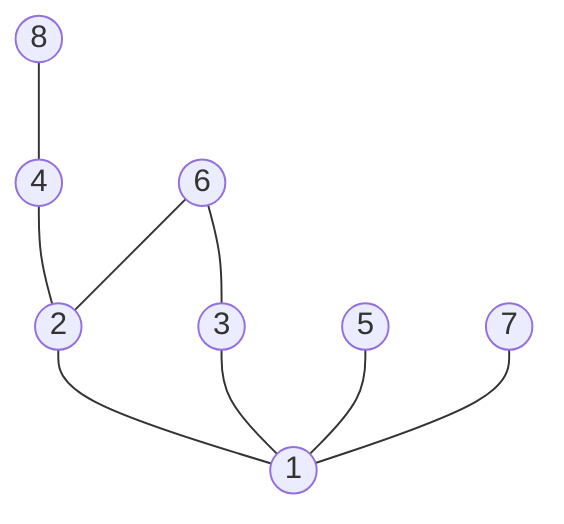
| Teilmenge | maximale Elemente | größte Elemente |
|--|--|--|
| $\{2,3,6\}$ | $\{6\}$ | $\{6\}$ |
| $\{2,3\}$ | $\{2,3\}$ | $\{\}$ |
| $\{2,3,5,6\}$ | $\{5,6\}$ | $\{\}$ |
| $\{1,2,3,4,5,6,7,8\}$ | $\{5,6,7,8\}$ | $\{\}$ |

> **Definition: Supremum / Infumum**
> Ordnungsrelation $\leq$ in $M$ mit $T \subseteq M$
> 1.	obereSchranke $\in M$ von $T$ 


### 1.5 Verbände
### 1.6 Äquivalenzrelationen
### 1.7 Restklassen
### 1.8 Abbildungen

## 2. Algebraische Strukturen
### 2.1 Verknüpfungen
### 2.2 Restklassenoperationen
### 2.3 Gruppen
### 2.4 Restklassengruppen mit Multiplikation
### 2.5 Untergruppen
### 2.6 Isomorphismen

<!--stackedit_data:
eyJoaXN0b3J5IjpbLTMxMTczNTM3NSwyMDQ1ODM4OTI5LC0xMj
M5MjQ0ODQyLDg3NTAzNTg2OSw3NTQyMjMyNTIsLTI1OTM4OTMz
Nyw3NDc5NDg1ODcsMjA5Mzg2Njg0MCwxNjE5MzI3NjI1LDg2Mz
Y1OTU0NywxNDY1MTQ4MjU1LDE0NjMyNTIwMzksLTIwNzI3NzMy
NTksLTg0ODc1NDQ1NCwtMjEyNjU0MTgxOCw3NTE0NzYwMTUsMT
MwNDQyNDgyMF19
-->