> # Inhaltsverzeichnis - Diskrete Mathematik
> ## 1.  Relationen
> ### 1.1 Allgemeine Relationen und deren Darstellung
> ### 1.2 Eigenschaften von Relationen
> ### 1.3 Ordnungsrelationen
> ### 1.4 Größte und Maximale Elemente, obere Schranken und Suprema
> ### 1.5 Verbände
> ### 1.6 Äquivalenzrelationen
> ### 1.7 Restklassen
> ### 1.8 Abbildungen
> ## 2. Algebraische Strukturen
> ### 2.1 Verknüpfungen
> ### 2.2 Restklassenoperationen
> ### 2.3 Gruppen
> ### 2.4 Restklassengruppen mit Multiplikation
> ### 2.5 Untergruppen
> ### 2.6 Isomorphismen
> 
> # Inhaltsverzeichnis - Kryptologie
> 
> ## 1.	Einführung
> ### 1.1	Symmetrische Verschlüsselungsverfahren
> ### 1.2	Asymmetrische Verschlüsselungsverfahren
> ## 2.	Klassische Verfahren
> ### 2.1	Skytale
> ### 2.2	Caesar
> ### 2.3	Permutations-Chiffren
> ### 2.4	Verfahren zur Entschlüsselung für  `monoalphabetische` Substitutionsverfahren
> #### 2.4.1	Häufigkeitsanalyse
> ### 2.5	Vigenère-Chiffre
> ### 2.6	Verfahren zur Entschlüsselung für  `polyalphabetischen` Substitutionsverfahren
> #### 2.6.1	Kasiski-Test
> #### 2.6.2	Friedman-Test
> ### 2.7	One Time Pad Verfahren
> ## 3.	Euler und Fermat
> ## 4.	RSA-Verschlüsselung
> ## 5.	Primzahltests
> ### 5.1	Fermatsche Pseudoprimzahl
> ### 5.2	Miller-Rabin-Test
> ## 6.	Diskreter Logarithmus
> ### 6.1	Diffie-Hellman-Key-Exchange
> ### 6.2	ElGamal-Kryptosystem
> ## 7.	Integrität und Authentizität von Nachrichten
> ### 7.1	Hash Funktion

# Diskrete Mathematik

## 1.  Relationen
### 1.1 Allgemeine Relationen und deren Darstellung

-	Relationen stellen Beziehungen zwischen Objekten dar
-	Relationen können zur Beschreibung von Ordnungen und Äquivalenzen genutzt werden
-	Relationen sind Mengen

> **Definition: Relation**
> Eine binäre Relation zwischen zwei Mengen ist eine Teilmenge des kartesischen Produkts:
> $R \subseteq M \times N$
> Für die Paare $(x,y) \in R$ gilt: $x$ steht in Relation zu $y$ (auch $x R y$)

#### Darstellung von Relationen
*Beispiel: $R = \{(1,a); (1,c); (2,b); (3,b); (3,c); (4,a)\}$*

`1.1.1 Pfeildiagramme`
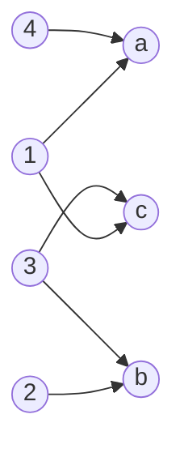
`1.1.2 Matrixschreibweise (Adjazenzmatrix)`
|$M$ \ $N$| a | b | c |
|--|--|--|--|
| 1 | 1 | 0 | 1 |
| 2 | 0 | 1 | 0 |
| 3 | 0 | 1 | 1 |
| 4 | 1 | 0 | 0 |


`1.1.3 vereinfachtes Pfeildiagramm`
*Pfeildiagramm kann vereinfacht werden, wenn die beiden Mengen **identisch** sind.*

*Beispiel: $R = \{(1,2); (1,5); (1,6); (2,2); (2,4)\}$
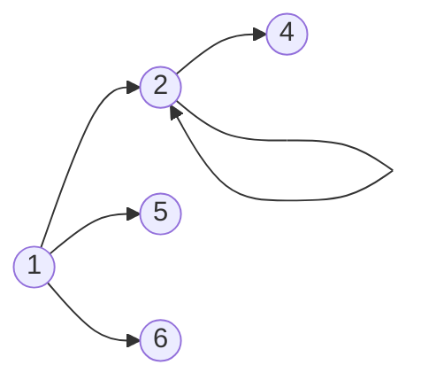
---
Anzahl der möglichen Paare einer Menge am Beispiel: 
$$
M=\{1;2;3;4;5;6\}
$$$$
|M| = 6
$$
- Anzahl der Paare von $M = 6 \times 6 = 36$
- Anzahl der Relationen von $M = 2^{36} \approx 64 Milliarden$, da alle Teilmengen von $M$ Relationen sind

> **Definition: Inverse Relationen**
> Wenn $R$ eine Relation mit $R \subseteq M \times N$ ist, dann ist die Inverse Relation $R^{-1} \subseteq N \times M$.
> $R^{-1} = \{(y,x) | (x,y) \in R\}$

_Beispiel für inverse Relationen:_
$R = \{(r,l) \in M \times M | r$ "ist Mutter von" $l\}$
$R^{-1} = \{(l,r) \in M \times M | l$ "hat als Mutter" $r\}$

> **Rechenregeln inverser Relationen**
> 1. $(R_1 \circ R_2)^{-1} = R_2^{-1} \circ R_1^{-1}$
> 2. $(R_1^{-1})^{-1} = R_1$

> **Definition: Verkettung (=Komposition) von Relationen**
> Die Verkettung von den Relationen $R_1 \subseteq A \times B$ und $R_2 \subseteq B \times C$ wird folgendermaßen dargestellt: $R_1 \circ R_2 = M_1 \times M_3$
> $$R_1 \circ R_2 = \{(a,c) | (a \in A) \land (c \in C) \land (\exist b \in B: ((a,b) \in R_1) \land ((b,c) \in R_2))\}$$

_Beispiel für verkettete Relationen:_
$R_1 = \{(l,r) |l$ "hat als Mutter" $r\}$
$R_2 = \{(r,e) | r$ "war verheitatet mit" $e\}$
$R_1 \circ R_2 = \{(l,e) | l$ "hat als Vater" $e\}$

> **Assoziativgesetz bei der Verkettung von Relationen**
> $$(R_1 \circ R_2) \circ R_3 = R_1 \circ (R_2 \circ R_3)$$

### 1.2 Eigenschaften von Relationen

| Eigenschaft | Definition |
|:--|:--|
| 1. **identische** Relation | $I=\{(x,x)$\| $x \in M\}$ |
| 2. **reflexive** Relation | $\forall x \in M: (x,x) \in R$ |
| 3. **irreflexive** Relation | $\forall x \in M: (x,x) \notin R$ |
| 4. **symmetrische** Relation | $\forall x,y \in M: (x,y) \in R \implies (y,x) \in R$ |
| 5. **asymmetrische** Realtion | $\forall x,y \in M: (x,y) \in R \implies (y,x) \notin R$ |
| 6. **antisymmetrische** Relation | $\forall x,y \in M: (x,y) \in R\land  (y,x) \in R \implies x = y$ |
| 7. **transitive** Relation | $\forall x,y,z \in M: (x,y) \in R \land (y,z) \in R \implies (x,z) \in R$ |

_Beispiele:_
1. _identische Relationen_
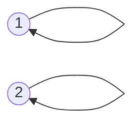
2. _reflexive Relationen_
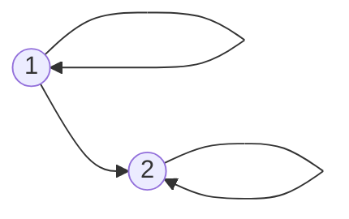
3. _irreflexive Relationen_
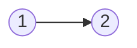
4. _symmetrische Relationen_ 

5. _asymmetrische Relationen_
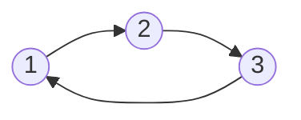
6. _antisymmetrische Relationen_

7. _transitive Relationen_ 
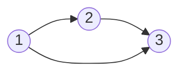

> **Zusammenhänge der Eigenschaften von Relationen**
> ```mermaid
> graph LR
> A((asymmetrisch)) --ist auch--> I((irreflexiv))
> I --ist nicht--> R((reflexiv))
> R --ist nicht--> I
> A --ist auch--> AN((antisymmetrisch))
> ```

> **Definition: Transitiv (reflexive) Hülle**
> Die **transitive Hülle** von der Relation $R$ wird gekennzeichnet durch $R^{+}$ und beinhaltet die Paare, die durch die Eigenschaft der Transitivität möglich werden.
> Die **reflexiv transitive Hülle** der Relation $R$ wird gekennzeichnet durch $R^{*}$ und beinhaltet zusätzlich zur transitiven Hülle die reflexiven Paare. Sie ist die kleinste transtitive und reflexive Relation, die $R$ umfasst.

_Beispiele_
_transitive Hülle (Praxisbeispiel: Organigramme in Unternehmen)_
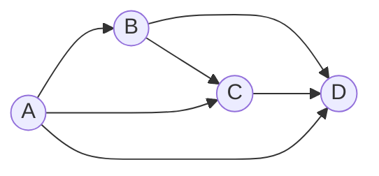
_reflexiv transitive Hülle_
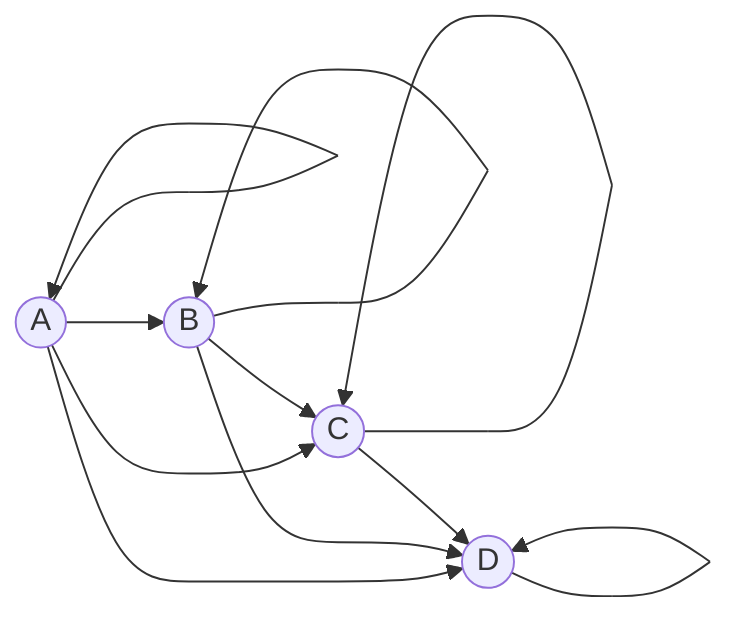

### 1.3 Ordnungsrelationen 

> **Definition: (*strikte*) Ordnungsrelation**
> Die Ordnungsrelation ist eine Verallgemeinerung der "$\leq$"-Beziehung.
> Durch diese können Elemente einer Menge miteinander verglichen werden.
> 
> Eine **Ordnung** in $M$ existiert, wenn die Relation alle der folgenden Eigenschaften besitzt:
> -	reflexiv
> -	antisymmetrisch
> -	transitiv
> 
> Eine ***strikte* Ordnung** in $M$ existiert, wenn die Relation folgende Eigenschaften besitzt:
> -	asymmetrisch
> -	transitiv

*Beispiel einer Ordnungsrelation: Bsp. $\leq$*
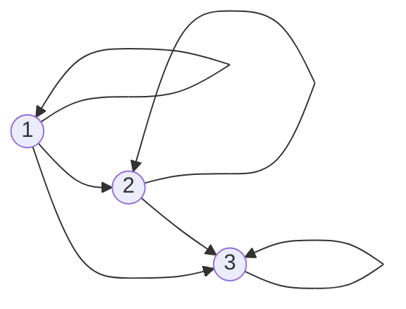
*Beispiel einer strikten Ordnungsrelation: Bsp. $\lt$*
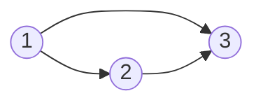

> **Definition: *totale* Ordnungsrelation**
> Bei einer ***totalen* Ordnungsrelation** sind je zwei Elemente von $M$ bezüglich der Relation $R$ vergleichbar:
> $\forall x, y \in M: (x,y) \in R \lor (y,x) \in R$
>
> Sollte diese Eigenschaft nicht gegeben sein, spricht man von einer ***partiellen* Ordnung / Teilordnung**

*Beispiel: totale Ordnungsrelation*
Die Ordnungsrelation $\leq$ ist eine totale Ordnungsrelation in $\N$, da zwei Zahlen immer vergleichbar sind (5 $\leq$ 3 $\lor$ 3 $\leq$ 5).

*Beispiel: partielle Ordnungsrelation*
Die Ordnung "$:$" (geteilt durch) ist eine partielle Ordnungsrelation in $\N$, da die Relation $\frac{2}{3}$ oder $\frac{3}{2}$ in $\N$ nicht vergleichbar ist.

> **Definition: Nachbarschaftsrelation**
> Bei einer strikten Ordnungsrelation $\lt$ in $M$ ist die Nachbarschaftsrelation gegeben durch:
> $x \lt^{N} y \iff (x \lt y) \land (\nexists z \in M: (x \lt z) \land (z \lt y))$
> Es existiert kein Wert der Menge $M$ der zwischen die Werte $x$ und $y$ passt.

*Beispiel: Nachbarschaftrelation*
Strikte Ordnungsrelation $\lt$ in $\N: x = 3, y = 4$
$3 \lt^{N} 4 \iff (3 \lt 4) \land (\nexists z \in \N: (3 \lt z) \land (z \lt 4))$ - wahre Aussage
$3 \lt^{N} 5 \iff (3 \lt 5) \land (\nexists z \in \N: (3 \lt z) \land (z \lt 5))$ - falsche Aussage, da $z = 4$ existiert.

> **Hasse Diagramm**
> Das Hasse Diagramm ist eine grafische Darstellung in Form eines Pfeildiagramms der Nachbarschaftsrelation. (Reflexive und Transitive Verbindungen werden hierbei weggelassen)

*Beispiel: Hasse Diagramm*
Betrachtet wird die Nachbarschaftsrelation von der Menger aller **Teiler** von 70 $T_{70}=\{1, 2, 5, 7, 10, 14, 35, 70\}$

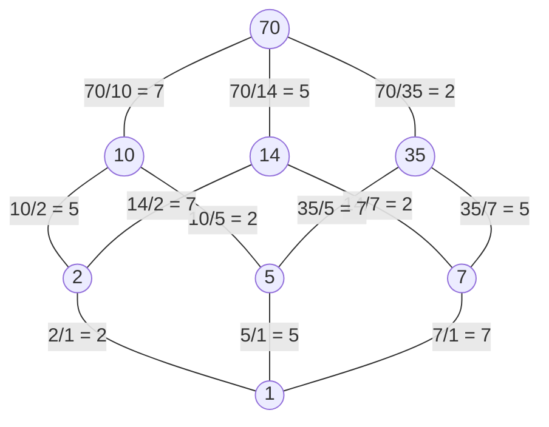

> **Informationserhaltungssatz für Hasse Diagramme**
> Wenn die Ordnungsrelation $\leq$ eine 
> -	**endliche Menge** ist, gilt: $(\leq^{N})^{*} = \:\leq$
> -	**beliebige Menge** ist, gilt: $(\leq^{N})^{*} \subseteq \: \leq$ 
> 
> Die Nachbarschaftsrelation ist also ausreichend zur Beschreibung der Ordnungsrelation, da mithilfe der transitiv-reflexiven Hülle dir Relation vollständig konstruiert werden kann.
> 
> *Für die Darstellung von Ordnungsrelationen in unendlichen Mengen (Bsp. $\R$) ist das Hasse Diagramm keine geeignete Darstellungsmethode, da hier ein Informationsverlust vorliegen kann*

### 1.4 Größte und Maximale Elemente, obere Schranken und Suprema

> **Definition: Größte - und Maximale Elemente**
> Sei $\leq$ eine Ordnungsrelation in $M$.
> **Größtes Element:**
> $größtesElement \in M \land \forall x \in M: x \leq größtesElement$ 
> 
> Eigenschaften:
> -	Größtes Element $\in M$
> -	Größtes Element ist mit allen Elementen aus $M$ vergleichbar
> -	Beim Vergleich zu den anderen Elementen in $M$, ist das größte Element $\leq$ alle anderen Elemente der Menge.
> -	Es gibt maximal ein größtes Element der Menge $M$
> -	Jedes größte Element ist auch ein maximales Element
> 
> **Maximales Element**
> $maximalesElement \in M \land \forall x \in M: maximalesElement \leq x \implies x = maximales Element$
> Eigenschaften:
> -	Maximales Element $\in M$
> -	Es ist nicht unbedingt mit allen Elementen vergleichbar
> -	Wenn es vergleichbar ist, dann ist es das größere

*Beispiel: $M=\{1,2,3,4,5,6,7,8\}, R=/$*
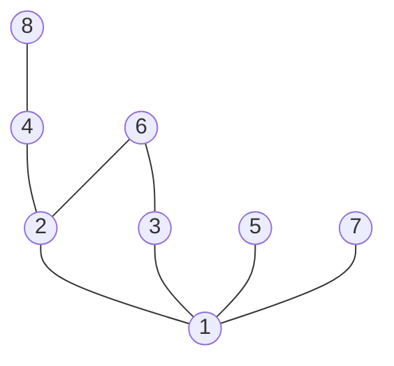
| Teilmenge | maximale Elemente | größtes Element |
|--|--|--|
| $\{2,3,6\}$ | $\{6\}$ | 6 |
| $\{2,3\}$ | $\{2,3\}$ | $\{\}$ |
| $\{2,3,5,6\}$ | $\{5,6\}$ | $\{\}$ |
| $\{1,2,3,4,5,6,7,8\}$ | $\{5,6,7,8\}$ | $\{\}$ |

> **Definition: Supremum / Infimum**
> Ordnungsrelation $\leq$ in $M$ mit $T \subseteq M$
> 1.	$obereSchranke \in M$ von $T: \forall x \in T: x \leq obereSchranke$
>
> 2.	$untereSchranke \in M$ von $T: \forall x \in T: untereSchranke \leq x$
>
> 3.	$obereGrenze \in M$ von $T$ ist definiert durch das minimale Element der oberen Schranken
>
> 4.	$untereGrenze \in M$ von $T$ ist definiert durch das maximale Element der unteren Schranken
>
> 5.	$Supremum$ ist definiert durch das kleinste Element der Menge der oberen Schranken.
>
> 6.	$Infimum$ ist definiert durch das größte Element der Menge der unteren Schranken. 

*Beispiel: Supremum / Infimum*
| Teilmenge | Infimum | Supremum | minimale Element | maximale Element |
|--|--|--|--|--|
| $\{2,3,6\}$ | $2$ | $6$ | $2$ | $6$ |
| $[0,8)\in \R$ | $0$ | $8$ | 0 | $\{\}$ |

*Beispiel: Obere Grenze:*
$\{3,4\} \in \{1,2,3,4,5,6,7\} \text{ in }  R=/$
-	Obere Schranken: $\{5,6,7\}$
-	Obere Grenze: $\{5,6\}$
-	kein Supremum

> **Definition: Existenzsatz Supremum**
> Eine Menge hat ein Supremum, wenn sie **nur eine** obere Grenze hat.
> 
> **Definition: Existenzsatz Infimum**
> Eine Menge hat ein Infimum, wenn sie **nur eine** untere Grenze hat.


### 1.5 Verbände

> **Definition: Verband**
> Zu zwei Elementen $a,b\in M$ existiert das $Supremum$ und das $Infimum$:
> $a \sqcup b = sup\{a,b\}$
> $a \sqcap b = inf\{a,b\}$

### 1.6 Äquivalenzrelationen

> **Definition: Äquivalenzrelation**
> $R$ heißt Aquivalenzrelation, wenn
> -	$R$ ist reflexiv
> -	$R$ ist symmetrisch
> -	$R$ ist transitiv
> 
> Äquivalenzrelationen werden auch durch $\equiv$ dargestellt.

> **Definition: Äquivalenzklasse**
> Jedes Element der Äquivalenzrelation in $M$ ist in der Äquivalenzklasse $[x]$
> $[x] = \{y \in M: y \equiv x\}$

> **Eigenschaften von Äquivalenzklassen**
> 1.	Reflexivität: $x \in [x]$
> 2.	Symmetrie: $y \in [x] \implies x\in [y]$
> 3.	Transitivität: $(x \in [y] \land y \in [z]) \implies x \in [z]$
> 
> Außerdem gilt:
> Die Menge der Äquivalenzklassen von $M$ ergibt zusammengenommen die ganze Menge $M$. 
> $$\bigcup_{x \in M} [x] = M$$

### 1.7 Restklassen

> **Definition: Kongruenz modulo m**
> Zwei natürlichen Zahlen sind **kongruent modulo m** oder $\equiv_{m}$, wenn sie bei der Division durch die natürliche Zahl $m$ denselben Rest $r$ lassen.
> Hierbei entsteht folgende Äquivalenzrelation: $\equiv_{m} \subseteq \Z \times \Z$
> Die Aquivalenzklassen der Relation heißen **Restklassen modulo m**.

*Beispiele: Kongruenz modulo m*
-	Äquivalenzklassen von $\equiv_{2}$ sind gerade und ungerade Zahlen.
	-	ungerade zahlen $[1]_2$
	-	gerade Zahlen $[2]_2$
-	Äquivalenzklassen von $\equiv_{10}$
	-	$[0]_{10} = \{0, 10, 20, ...\}$
	-	$[1]_{10} = \{1, 11, 21, ...\}$
	-	$[2]_{10} = \{2, 12, 22, ...\}$
	-	$[3]_{10} = \{3, 13, 23, ...\}$
	-	$[4]_{10} = \{4, 14, 24, ...\}$
	-	$[5]_{10} = \{5, 15, 25, ...\}$
	-	$[6]_{10} = \{6, 16, 26, ...\}$
	-	$[7]_{10} = \{7, 17, 27, ...\}$
	-	$[8]_{10} = \{8, 18, 28, ...\}$
	-	$[9]_{10} = \{9, 19, 29, ...\}$

### 1.8 Abbildungen

> **Definition: Abbildung**
> Eine Abbildung beschreibt die Zuordnung von der Quell- zur Zielmenge.
> **Eigenschaften einer Abbildung**
> 1.	Existenz
> 2.	Eindeutigkeit

> **Definition: Links- / Rechtseindeutigkeit**
> **Linkseindeutigkeit**
> -	Jeder Punkt in der Zielmenge wird **max.** einmal aus der Quellmenge getroffen.
> -	Jedem Punkt in der Zielmenge ist **eindeutig** einem Punkt der Quellmenge zuzuordnen.
> $$\forall x,y \in A: \forall z \in B: (x,z) \in R \land (y,z) \in R \implies x = y$$
> 
> **Rechtseindeutigkeit**
> -	Jeder Punkt in der Quellmenge wird **max.** einmal aus der Zielmenge getroffen.
> -	Jedem Punkt in der Quellmenge ist **eindeutig** einem Punkt der Zielmenge zuzuordnen.
> $$\forall x,y \in B: \forall z \in A: (z,x) \in R \land (z,y) \in R \implies x = y$$
> 
> **Eigenschaften**
> -	Bei inversen Relationen $(R^{-1})$ wird die Eindeutigkeit umgedreht.
> *Beispielt: linkseindeutige Relation* $R \rightarrow$ *rechtseindeutige Relation* $R^{-1}$
> -	Bei Verkettung bleiben die Eigenschaften erhalten.
> *Beispiel: linkseindeutige Relationen* $R_1, R_2 \rightarrow R_1 \circ R_2$ bleibt linkseindeutig

*Beispiel Links-/Rechtseindeutigkeit:*
*Linkseindeutigkeit:*
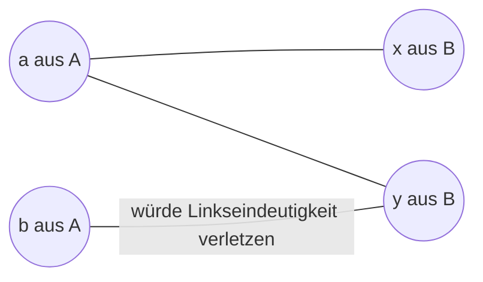

*Rechtseindeutigkeit:*
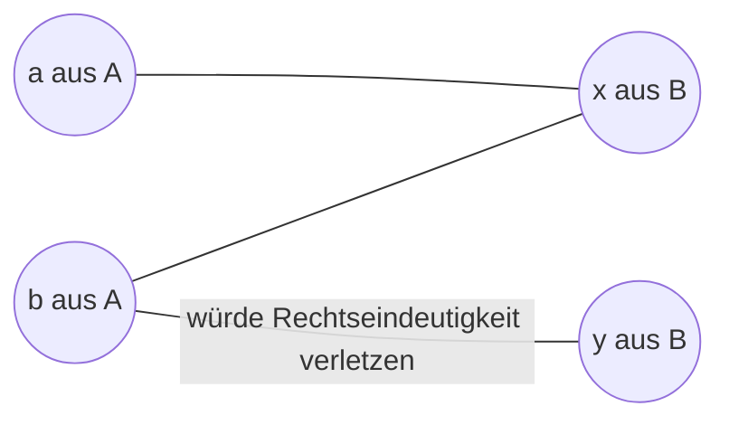

> **Definition: Links- und Rechtstotalität**
> **Linkstotalität**
> $\forall x \in A: \exists y \in B: (x,y) \in R$
> 
> **Rechtstotalität**
> $\forall y \in B: \exists x \in A: (x,y) \in R$
> 
> **Eigenschaften**
> -	Bei inversen Relationen $(R^{-1})$ wird die Totalität umgedreht.
> *Beispielt: linkstotale Relation* $R \rightarrow$ *rechtstotale Relation* $R^{-1}$
> -	Bei Verkettung bleiben die Eigenschaften erhalten.
> *Beispiel: linkstotale Relationen* $R_1, R_2 \rightarrow R_1 \circ R_2$ bleibt linkstotal

*Beispiel Links-/Rechtstotalität:*
*Linkstotalität*
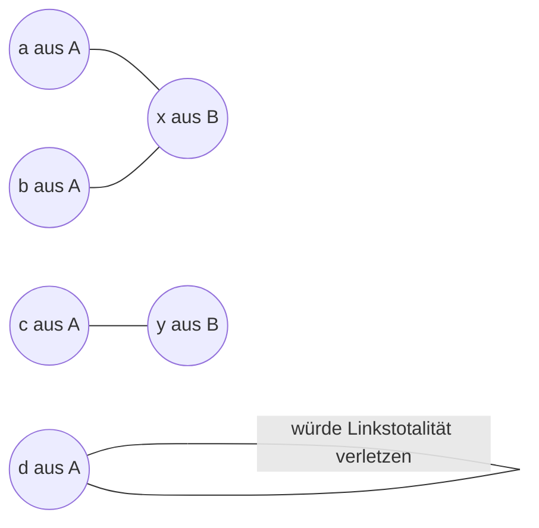

*Rechtstotalität*
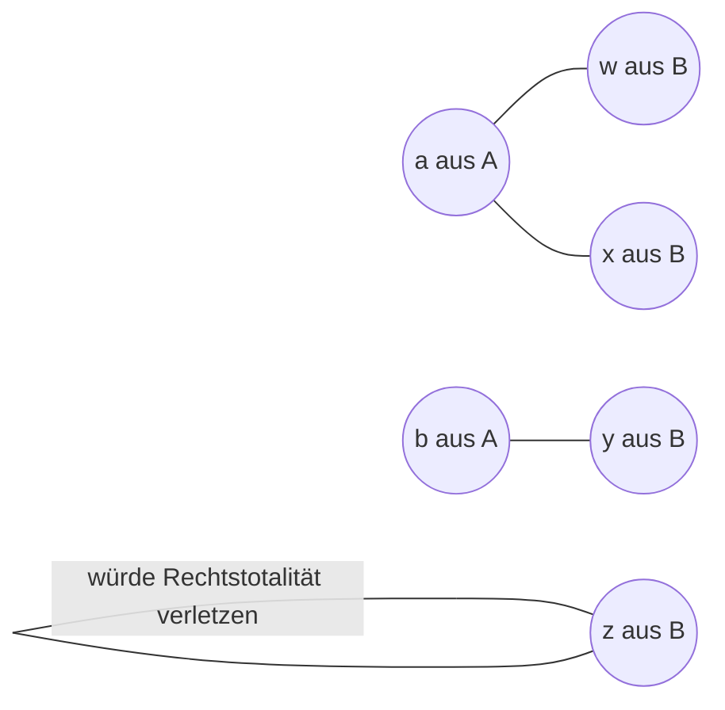
> **Definition: Abbildung**
> Eine Relation heißt Abbildung oder Funktion, wenn sie 
> - **rechtseindeutig** und  (= Jeder X-Wert hat nur einen einzigen zugehörigen Y-Wert)
> - **linkstotal** ist. (= Jeder X-Wert hat einen Y-Wert)
> 
> Zu jedem $x \in A$ existiert **genau ein** $y \in B$, sodass $(x,y) \in R$
> 
> Schreibweise für eine Abbildung $R$ von $A$ nach $B$: $R: A \rightarrow B$
> 
> $A$ ist hierbei der Definitionsbereich oder auch Quellmenge
> $B$ ist hierbei das Bild oder auch Zielmenge

*Beispiel: Abbildung anhand der Funktion* $f(x) = 2x$
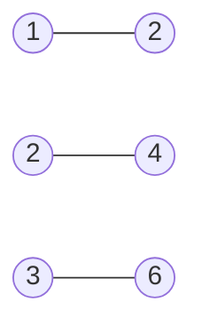
*weitere Abbildung*
``` mermaid
graph RL
x((x)) --- a((a))
y((y)) --- b((b))
y --- c((c))
z((z))
```

> **Eigenschaften von Abbildungen**
> - **surjektiv**, wenn die Abbildung rechtstotal ist (= Jedem Y-Wert ist ein X-Wert zugeordnet)
> - **injektiv**, wenn die Abbildung linkseindeutig ist (= Jedem Y-Wert kann genau ein X-Wert zugeordnet werden Bsp. $f(x) = 2x$)
> - **bijektiv**, wenn die Abbildung linkseindeutig und rechtstotal ist


## 2. Algebraische Strukturen

### 2.1 Verknüpfungen

> **Definition: Verknüpfung**
> Die Verknüpfung einer nichtleeren Menge ist eine Abbildung.
> Das Ergebnis zweier verknüpfter Elemente wird dargestellt durch $x \circ y$
> 
> Das Paar $(M, \circ)$ wird algebraische Struktur genannt.

> **Kommutativgesetz**
> Eine algebraische Struktur ist kommutativ, falls 
> $\forall x,y \in M: x \circ y = y \circ x$
> 
> **Assoziativgesetz**
> Eine algebraische Struktur ist assoziativ, falls
> $\forall x,y,z \in M: (x \circ y) \circ z = x \circ (y \circ z)$

*Beispiele für algebraische Strukturen:*
-	Addition von natürlichen Zahlen: $(\N, +)$ [kommutativ und assoziativ]
-	Addition von ganzen Zahlen: $(\Z, +)$ [kommutativ und assoziativ]
-	Subtraktion von ganzen Zahlen: $(\Z, -)$ [nicht kommutativ und nicht assoziativ]

```
Bemerkung: Die Subtraktion von natürlichen Zahlen ist keine algebraische Struktur,
da bei negativen Ergebnissen der Bereich der natürlichen Zahlen verlassen wird
```

**Darstellungsform: Verknüpfungstafel**
*Beispiel: algebraische Struktur* $(\{1,2,3\}, +)$
| + | 1 | 2 | 3 |
|:--:|--|--|--|
| **1** | 2 | *3* | *4* |
| **2** | *3* | 4 | *5* |
| **3** | *4* | *5* | 6 |

```
Bemerkung: Die algebraische Struktur ist kommutativ, 
wenn die Verknüpfungstafel an der Diagonalen (hier 2,4,6) symmetrisch ist.
```
> **Existenzsatz**
> $\forall a,b \in M: \exists x \in M: a \circ x = b$
> 
> Angewendet auf die Verknüpfungstafel: Jedes Element kommt in jeder Zeile der Tabelle mind. einmal vor. (Bei $... \:  x \circ a = b)$ kommt jedes Element in jeder Spalte mind. einmal vor.
> 
> **Eindeutigkeitssatz**
> $\forall a,b \in M: \forall x,y \in M: (a \circ x = b) \land (a \circ y = b) \implies x = y$
> 
> Angewendet auf die Verknüpfungstafel: Jedes Element kommt in jeder Zeile der Tabelle max. einmal vor. (Bei $... x \circ a = b \land y \circ a = b ...)$ kommt jedes Element in jeder Spalte max. einmal vor.


*Beispiel: Existenzsatz*
-   $(\Z, +)$: Existenzsatz gilt	
-	$(\N, +)$: Existenzsatz gilt nicht. Bsp. a = 20, b = 10

*Angewendet auf die Verknüpfungstafel:*
| $(\{-2, -1, 0, 1, 2\}, +)$ | -2 | -1 | 0 | 1 | 2 |
|:--:|--|--|--|--|--|
| **-2** | -4 | -3 | *-2* | *-1* | *0* |
| **-1** | -3 | *-2* | *-1* | *0* | *1* |
| **0** | *-2* | *-1* | *0* | *1* | *2* |
| **1** | *-1* | *0* | *1* | *2* | 3 |
| **2** | *0* | *1* | *2* | 3 | 4 |

*Beispiel: Eindeutigkeitssatz*
-	$(\N, +)$: Eindeutigkeitssatz gilt
-	$(\Z, *)$: Eindeutigkeitssatz gilt nicht. Bsp. $4*5 = 20$ und $2* 10 = 20$

*Angewendet auf die Verknüpfungstafel*
| $(\{1,2,3\}, +)$ | 1 | 2 | 3 |
|:--:|--|--|--|
| **1** | *2* | *3* | 4 |
| **2** | *3* | 4 | 5 |
| **3** | 4 | 5 | 6 |

> **Definition: Endliche Algebraische Strukturen**
> Eine endliche algebraische Struktur existiert, wenn Eindeutigkeit und Existenz gleichwertig sind.

### 2.2 Restklassenoperationen

> **Definition: Restklassenoperationen**
> **Restklassenaddition**
> $[a]_m \oplus [b]_m = [a + b]_m$
> 
> **Restklassenmultiplikation**
> $[a]_m \otimes [b]_m = [a * b]_m$

> **Unabhängigkeit vom Repräsentanten**
> Eigenschaften von Äquivalenzklassen, die anhand eines Repräsentanten festgelegt werden müssen bewiesen werden, dass die unabhängig vom Repräsentanten gelten.

*Beispiel: Beweis Unabhängigkeit vom Repräsentanten*
`zu beweisen:` $(\Z /m, \oplus)$
`gegeben:` $a,b, x, y \in \Z$ mit $[a]_m = [b]_m \land [x]_m = [y]_m$
`zu zeigen:` $[a+b]_m = [x+y]_m$
`nach Voraussetzung:` $o, p \in \Z$, so dass $a-b = o*m$ und $x-y = p*m$
`dann gilt:` 
$a + b - (x - y)$
$= a - b + x - y$
$= o * m + p * m$
$= m (o + p)$

```
Bemerkung: Rechnen mit Restklassenoperationen kann durch 
die korrekte Wahl des Repräsentanten vereinfacht werden.

Außerdem können bei Unabhängigkeit des Repräsentanten 
Kommutativ- und Assoziativgesetze angewendet werden.
```

### 2.3 Gruppen

> **Definition: Gruppe**
> Eine algebraische Struktur heißt Gruppe $G$, wenn folgendes gilt:
> -	Assoziativität
> -	Es gibt ein neutrales Element $n$ der Gruppe mit: $\forall a \in G: n \circ a = a$
>      Es gibt ein inverses Element der Gruppe mit: $\forall a \in G: \exists b \in G: a \circ b = n$
> 
> $oder$
> 
> -	Assoziativität
> -	Existenzsatz der algebraischen Struktur

> **Definition: Abelsche Gruppe**
> Eine Abelsche Gruppe hat zur Gruppe die zusätzliche Definition der Kommutativität. In diesem Fall wird $+$ anstatt von $\circ$ verwendet.

*Beispiel Neutrale und Inverse Elemente:*
-	Neutrales Element der Addition: **0** (Bsp. $5 + 0 = 5$)
-	Neutrales Element der Multiplikation: **1** (Bsp. $5 * 1 = 5$)
-	Inverses Element der Addition: Element $a$, Inverses- $-a$ (Bsp. $5 - 5 = 0$
-	Inverses Element der Multiplikation: Element $a$, Inverses Element $a^{-1}$ oder $\frac1a$

`Bemerkung: Es gibt genau ein Neutrales Element.`


> **Eindeutigkeit der Lösbarkeit von einer Gruppe**
> Für jede Gruppe gilt der Eindeutigkeitssatz. D.h. es gibt für jedes $a,b \in G$ höchstens eine Lösung $c \in G$ der Gleichung $a \circ c = b$

> **Ordnung einer Gruppe**
> Als Ordnung einer Gruppe wird die Anzahl der Elemente definiert.
> $$|G|$$

*Beispiel zur Ordnung einer Gruppe:*
$|(\{1,2,3\}, +)| = 3$


### 2.4 Restklassengruppen mit Multiplikation

*Beispiel: ggT durch Primfaktorzerlegung - ggT(240,420)*
$240 = 2 * 2 * (2 * 2 * 3 * 5)$
$420 = (2 * 2 * 3 * 5) * 7$
$ggT(240,420) = 2 * 2 * 3 * 5 = 60$

> **Definition: "div" und "mod"**
> $a = q * b + r$
> $q = a \: div \: b$ `Quotient der Division`
> $r = a \: mod \: b$ `Rest der Division`

*Beispiel: a = 68, b = 10*
$q = \frac{68}{10} = 6$
$r = 68 \: mod \: 10 = 8$
$68 = 6 * 10 + 8$

> **gemeinsame Teiler**
> $a = q * b + r$
> Die Menge $gT(a,b)$ der gemeinsamen Teiler ist gleich der Menge $gT(b,r)$
> Am Beispiel von oben: $gT(68, 10) = \{2\} = gT(10, 8)$

> **Euklidischer Algorithmus**
> Algorithmus zur Berechnung des $ggT$ zweier positiver ganzer Zahlen $a$ und $b$
> $ggT(a, b): (a > b)$ 
> $a = q * b + r_1$
> $b = q * r_1 + r_2$
> $r_1 = q * r_2 + r_3$
> $...$
> $r_{n-1} = q * r_n + 0$
> $ggT(a,b) = r_n$
> `Bemerkung: q ist der Quotient und Zeilenunabhängig`

> **Definition: Satz von Bézout**
> Für $a, b$ gibt es ein $a^{*} \in \N$ und $b^{*} \in \Z$, mit:
> $$a^{*}*a + b^{*} * b = ggT(a,b)$$

*Beispiel: Satz von Bézout:*

$a = 17, b = 5$
$ggT(17,5) = 1$
$a^{*} \in \N = 3$
$b^{*} \in \Z = -10$
$a^{*} * a + b^{*}*b = 3 * 17 + (- 10 * 5) = 1 = ggT(17,5)$

> **Existenzsatz: Multiplikative Inverse Restklasse**
> Eine Restklasse $[a]_m$ besitzt nach dem Satz von Bézout ein multiplikatives Inverses $[a^{*}]_m$:
> $$[a]_m \otimes [a^{*}]_m = [1]_m$$

*Beispiel: Multiplikatives Inverse*
$[3]_5 \otimes [2]_5 = [1]_5$
$[2]_5$ ist die multiplikativ Inverse Restklasse zu $[3]_5$.

>**Multiplikative Restklassengruppe**
> Wenn der modulo eine Primzahl ist, dann ist $\Z / m$ \ $\{[0]_m\}$ eine Gruppe.

>**Existenzsatz: Restklassengleichung**
> Wenn der $ggT(a,m)$ durch $b$ teilbar ist, gilt folgende Gleichung:
> $$[a]_m \otimes [x]_m = [b]_m$$

>**Vorgehen:**
> ``` mermaid
> graph TD
> 1((Euklid-Algorithmus)) --> 2((ggT von a, m teilt b))
> 2 --nein--> no((keine Lösung))
> 2 --ja--> yes((eine / mehrere Lösungen))
> yes --> 3((Euklid rückwärts))
> 3 --> 4((Ergebnis * b/ggT))
> 4 --> 5((kleinsten Repräsentanten))
> 5 --> 6((Probe))
> ```

*Beispiel: Restklassengleichung*
$ggT(12,15) = 3$

$[12]_{15} \otimes [x]_{15} = [5]_{15}$
$3$ ist kein Teiler von $5 \rightarrow$ es gibt keine Lösung für die obige Gleichung.

$[12]_{15} \otimes [x]_{15} = [9]_{15}$
$3$ ist Teiler von $9$, da $9$ ein Vielfaches vom $ggT(12,15) = 3$ ist $\rightarrow$ die obige Gleichung besitzt Lösung(en):

Berechnung der Lösung:
1. Euklid-Algorithmus vorwärts: (evtl. einen höheren Repräsentanten wählen)
$[12]_{15} = [27]_{15}$
$27 = 1 * 15 + 12$
$15 = 1 * 12 + 3$ `hier für Euklid-Algorithmus rückwärts einsteigen`
$12 = 4 * 3 + 0$

2. Euklid-Alorithmus rückwärts:
$3 = 15 - 12$
$3 = 15 - (27 - 15)$
$3 = 2 * 15$ **- 1** $* 27$
$[-1]_{15} = [14]_{15}$
Daher ist das multiplikative Inverse von $[12]_{15}$ die Restklasse $[-1]_{15} = [14]_{15}$.
3. Multiplikator für das gesuchte $x$ identifizieren:
$b = 9, ggT(a,m) = 3 \implies \frac{9}{3} = 3$
4. Lösung finden:
$x = (Multiplikator * multiplikatives Inverse) \: mod \: m = (3 * 14) \: mod \: 15 = 12$

Ergebnis: $[12]_{15} \otimes [12]_{15} = [9]_{15}$

### 2.5 Untergruppen

> **Definition: Untergruppe**
> Wenn eine Gruppe $(G, \circ)$ eine nichtleere Teilmenge $U$ besitzt, heißt diese **Untergruppe**, wenn sie selbst eine Gruppe mit $\circ$ bildet.
> Die Kurzschreibwese ist $U \leq G$

*Beispiel: Untergruppe*
Die Gruppe $(\Z, +)$ ist eine Untergruppe der Gruppe $(\mathbb{Q}, +)$
Also kurzgeschrieben: $(\Z, +) \leq (\mathbb{Q}, +)$

> **Untergruppen, die von einem Element erzeugt werden:**
> Eine von $g \in (G, \circ)$ erzeugte Untergruppe ist definiert durch die Menge $\{\underbrace{g \circ ... \circ g}_{k - mal} | k \in \N\}$ und hat folgende Schreibweise $<g>$.

Wiederholungen von Gruppenelementen:
$g \in (G, \circ)$ und $k \in \Z$
$g^{k}=\left \{ 
\begin{array}{ll} 
\underbrace{g \circ ... \circ g}_{k-mal} & falls & k > 0
\\\\ e (\text{neutrales Element}) & falls & k = 0
\\\\ \underbrace{g^{-1} \circ ... \circ g^{-1}}_{-k-mal} & falls & k < 0
\end{array}\right.$

> **Ordnung eines Gruppenelements**
> Die Ordnung eines Gruppenelements schreibt man durch $ord(g)$ und bezeichnet die kleinste Zahl $k \in \N$ für die gilt: $g^{k} = e$.
> Sollte es kein $k \in \N$ geben, für das gilt $g^{k} = e$, dann hat $g$ die Ordnung $\infin$.

*Beispiel: Ordnung eines Gruppenelements*
$(\Z/6, \oplus)$
| $g$ | $ord(g)$ | $<g>$ |
|--|--|--|
| 0 | 1 | $[0]_6$ |
| 1 | 6 | $\{[1]_6, [2]_6, [3]_6, [4]_6, [5]_6, [0]_6\}$ |
| 2 | 3 | $\{[2]_6, [4]_6, [0]_6\}$ |
| 3 | 2 | $\{[3]_6, [0]_6\}$ |
| 4 | 3 | $\{[4]_6, [2]_6, [0]_6\}$ |
| 5 | 6 | $\{[5]_6, [4]_6, [3]_6, [2]_6, [1]_6, [0]_6\}$ |

*Erklärung anhand eines Beispiels der Tabelle:*
Durch $(\Z /6, \oplus)$ ergibt sich am Beispiel von $g=4$ folgendes $<g>$:
$[4]_6 + [4]_6 = [8]_6 = [2]_6$
$[4]_6 + [4]_6 + [4]_6 = [12]_6 = [0]_6$
$[4]_6 + [4]_6 + [4]_6 + [4]_6 = [16]_6 = [4]_6$

> **Ordnung der Untergruppe:**
> Für die Untergruppe $H \leq (G, \circ)$ gilt:
> $$ord(H) | ord(G)$$

> **Satz von Euler:**
> $$g^{ord(G)} = e$$
> Dieser Satz gilt, da $$g^{ord(G)} = g^{k * ord(g)} =(g^{ord(g)})^k = e^k = e$$


### 2.6 Isomorphismen

> **Gruppenisomorphismus**
> Ein Isomorphismus ist eine **Abbildung** $\phi: G \rightarrow H$ der beliebigen Gruppen $(G, \circ)$ und $(H, \otimes)$, die folgende Eigenschaften hat:
> -	die Abbildung ist **bijektiv**
> -	die Abbildung ist **strukturerhaltend**: $\forall g_1, g_2 \in G: \phi(g_1 \circ g_2) = \phi(g_1) \otimes \phi (g_2)$
> -	die beiden Gruppen $G$ und $H$ haben dieselbe Anzahl von Elementen
> 
> Wenn es einen Isomorphismus zwischen $G$ und $H$ gibt, nennt man die beiden Gruppen isomorph.
> 
> **Isomorph = Iso + morph = gleich + gestaltet**
> 
> ---
> 
> **Erhaltung der Gruppenstruktur:**
> -	$\phi(e_G) = e_H$ 
> `Die Abbildung des neutralen Elements von G zeigt auf das neutrale Element von H`
> -	$\forall g \in G: ord(g) = ord(\phi(g))$ 
> `Die Ordnung eines Elements aus G ist gleich die Ordnung des Elements der Abbildung auf H`
> $\forall g \in G: \phi (g^{-1}) = \phi (g)^{-1}$
> `Die Abbildung des inversen Elements ist das inverse Element der Abbildung`

---

# Kryptologie

### Einführung

$Kryptografie$
$= Krypto + grafie$ 
$= geheim + schreiben$
$\rightarrow$ Die Lehre vom geheimen Schreiben

**Kryptologie:**
- Kryptografie + Kryptoanalyse
- ist Teilgebiet der Informationssicherheit 

> **Schutzziele:**
> - Vertrauligkeit
> 	-	Nachricht für Unbefugte nicht lesbar
> - Integrität:
> 	-	Nachricht nicht unbemerkt veränderbar
> - Authentizität
> 	-	Nachricht stammt tatsächlich vom angegebenen Absender
> - Verbindlichkeit
> 	-	Versand / Empfang ist nicht abzustreiten
> - Anonymität
> 	-	Absender / Empfänger bleibt geheim

> **Kryptosystem:**
> -	$P$ - Menge aller Klartexte
> -	$C$ - Menge aller Geheimtexte
> -	$K$ - Menge aller Schlüssel
> 
> Es ergeben sich folgende Abbildungen:
> -	encrypt: $e: P \times K \rightarrow C$
> -	decrypt: $d: C \times K \rightarrow P$


#### Symmetrische Verschlüsselungsverfahren

- Der Entschlüsselungs-Key ist aus dem Verschlüsselungs-Key leicht ermittelbar **oder** sie sind identisch
- Sender und Empfänger besitzen dasselbe Geheimnis
- Jeder mit der Möglichkeit zu verschlüsseln, hat auch die Möglichkeit zu entschlüsseln


#### Asymmetrische Verschlüsselungsverfahren

- Der Entschlüsselungs-Key ist nicht (in angemessener Zeit) aus dem Verschlüsselungs-Key ermittelbar
- Der Verschlüsselungs-Key kann vom Empfänger öffentlich bekannt gegeben werden $\rightarrow$ **public-key**
- Sender und Empfänger müssen kein Geheimnis austauschen
- Wer verschlüsseln kann, kann nicht entschlüsseln


### Klassische Verfahren

#### Skytale
> -	Ein Papier wird wendelförmig um einen Stab gewickelt und entlang der Stabseite beschrieben.
> -	Schlüssel: Durchmesser des Stabs
> -	Verfahren: Transpositionsverfahren (Veränderung der Stelle des Buchstabens)

*Beispiel Skytale:*
$P = "diesisteinbeispiel"$
$K= 4$
| 1 | 2 | 3 | 4 |
|--|--|--|--|
| d | i | e | s |
| i | s | t | e |
| i | n | b | e |
| i | s | p | i |
| e | l |  |  |
$C=diiieisnsletbpseei$

---

#### Caesar
> Verschiebung des Alphabets um einen Schlüssel k
> -	Schlüssel: $k \in \Z_{26}$
> -	Verfahren: monoalphabetisches Substitutionsverfahren

*Beispiel Caesar:*
$P = "diesisteinbeispiel"$
$K= 4$
|  | Alphabet |
|--|--|
| alt | $ABCDEFGHIJKLMNOPQRSTUVWXYZ$ |
| neu | $EFGHIJKLMNOPQRSTUVWXYZABCD$

$C=hmiw mwx imr fimwtmip$

---

#### Permutations-Chiffren
> Permutationen = Anordnungsmöglichkeiten
> Jeder Buchstabe kann auf jeden anderen beliebigen weiteren Buchstaben abgebildet werden $\rightarrow$ $|K| = 26!$
> -	Verfahren: monoalphabetisches Substitutionsverfahren
> -	Permutation ist eine bijektive Abbildung von der Menge auf sich selbst

*Beispiel Permutations-Chiffren:*
$P = "diesisteinbeispiel"$
$K= [neues Alphabet]$
|  | Alphabet |
|--|--|
| alt | $ABCDEFGHIJKLMNOPQRSTUVWXYZ$ |
| neu | $OSBWGDJVZFNMAYTQLEPRCHKIUX$

$C=wzgp zpr gza sgzpqzgm$

---

#### Verfahren zur Entschlüsselung für `monoalphabetische` Substitutionsverfahren

#### Häufigkeitsanalyse
> -	Häufigkeitsverteilung der Buchstaben analysieren
> -	Zuverlässigkeit steigt mit der Länge des Textes
> -	Sprachspezifische Besonderheiten werden ausgenutzt
> 
> Bigrammanalyse
> Buchstabenkombinationen werden analysiert (Häufigkeit)
> Bsp. "en", "er", "ch", "ei" usw.

---

#### Vigenère-Chiffre
> -	Verwendung mehrerer Caesar-Chiffren
> -	$K = gewähltes \: Schlüsselwort$
> -	Verfahren: Polyalphabetisches Substitutionsverfahren
> -	Sicherheit: hängt von der Länge- und der Zufälligkeit des Schlüssels ab

[](https://upload.wikimedia.org/wikipedia/commons/6/6d/VigenereSquare2.jpg)

*Beispiel Vigenère-Chiffre:*
$P = "diesisteinbeispiel"$
$K= GEHEIM$
|  |  |
|--|--|
| P | $d i e s i s t e i n b e i s p i e l$ |
| K | $g e h e i m g e h e i m g e h e i m$

$C= jmlw qez ipr jqowwmmx$

---

#### Verfahren zur Entschlüsselung für `polyalphabetischen` Substitutionsverfahren

#### Kasiski-Test
> -	Idee: Wiederholungen einer Zeichenfolge im Klartext mit einem $n$-fachen Abstand der Schlüssellänge, spiegeln sich im verschlüsselten Text wieder
> -	Beachte: Wiederholungen können auch zufällig auftreten
> -	Vorgehen:
> 1.	wiederholende Zeichenketten im Geheimtext untersuchen
> 2.	Indizies der Zeichenketten notieren
> 3.	Abstände ermitteln
> 4.	Zerlegung des Abstands in Primfaktoren
> 5.	gemeinsamen Teiler ermitteln, der in **allen** Abständen vorkommt $\rightarrow$ Schlüssellänge
> 6.	Aufteilen des Geheimtexts in Teiltexte
> 7. Häufigkeitsanalyse
> 8.	Schlüssel herausfinden

---

#### Friedman-Test
> Mithilfe des Friedman-Tests kann die Größenordnung des Schlüssels abgeschätzt werden, mit dem ein Text durch polyalphabetische Substitution verschlüsselt wurde.
> Idee: Je länger das Schlüsselwort, desto regelmäßiger sind die Häufigkeiten verteilt
> 1.	Annahme der Schlüssellänge treffen $|k|$
> 2.	Text in $|k|$-Spalten untereinander aufschreiben
> 3.	Koinzidenz pro Spalte ausrechnen  
> $$
> \kappa(m) = \frac{1}{n * (n-1)} * \sum\limits_{j=1}^{26} h_i * (h_i - 1) \\
> n = \text{Länge des Text} \\
> h_i = \text{Häufigkeit des jeweiligen Buchstabens}
> $$
> 4.	Koinzidenzen auf bekannte Werte prüfen ($\kappa_{DE} (m) \approx 0,0762, \kappa_{RND} (m) \approx 0,0385$ )
> 5.	Bei passenden Koinzidenzen sind die Spalten jeweils monoalphabetisch verschlüsselt (da die wahrscheinliche Schlüssellänge bekannt ist)

> **Perfekte Sicherheit**
> *Sicherheit durch Ununterscheidbarkeit*
> 1.	Angreifer wählt zwei bel. gleichlange Klartexte
> 2.	Einer der Texte wird zufällig gewählt und verschlüsselt
> 3.	Wenn der Angreifer eine Wahrscheinlichkeit von 50% hat, gilt das Kryptosystem als sicher.

> **One Time Pad Verfahren**
> -	ist ein perfekt sicheres Kryptosystem
> -	basiert auf dem Vigenère Verfahren, mit folgenden Vorgaben:
>	-	Schlüssellänge = Klartextlänge
> 	-	Schlüsselbuchstaben sind **zufällig** gewählt
> 	-	Schlüssel darf nur einmal verwendet werden
> -	Schwierigkeiten:
> 	-	Zufälligkeit
> 	-	Schlüsselgröße
> 	-	Schlüsselübertragung


### Euler und Fermat

> **Eulersche Phi-Funktion**
> $$\phi(n) = |\{a \in \N | 1 \leq a \leq n \land ggT(a,n) = 1\}|$$
> $\phi(n)$ ist die Anzahl der teilerfremden, natürlichen Zahlen zu $n$ im Bereich $[1,n]$.
> 
> Berechnung der Phi-Funktion
> -	 Wenn $p \text{ ist Primzahl}$, dann $\phi(p) = p -1$
> -	Wenn $p^k \text{ p ist Primzahl und } k \in \N$, dann $\phi(p) = p^k (1 - \frac{1}{p})$
> -	Wenn $m, n \in \N$, dann $\phi(p) = \phi(m) * \phi(n)$

> **Satz von Euler**
> $$a^{\phi (n)} \equiv_n 1, \:\: (a,n \in \N \land ggT(a,n) = 1)$$
> 
> *Beispiel:*
> $7^{222} mod \: 10$
> 1.	$ggT(7,10) = 1, \phi (10) = 4$
> 2.	$7^4 \equiv 1 \: (mod \: 10)$
> 3.	$7^{222} = 7^{4*55 + 2} = (7^4)^{55} * 7^2 = 1^{55} * 7^2 \: (mod \: 10) =49 \: (mod \: 10) = 9$
> 
> **Satz von Fermat**
> $$a^{p-1} \equiv_p 1, \:\: (p \text{ ist Primzahl}, a \in \N, 1 \leq a \leq p-1)$$


### RSA-Verschlüsselung

> **RSA-Verschlüsselung - asymmetrisches Verschlüsselungsverfahren**
> -	Verwendung zur Verschlüsselung und digitaler Signatur
> -	Jeder Teilnehmer benötigt zwei Schlüssel
> 	-	private key (*Entschlüsseln* / *Signieren der Nachricht*)
> 	-	public key (*Verschlüsseln* / *Prüfen der Nachricht*)
>
> **Konstruktion des public key**
> 1.	Wähle zwei sehr große Primzahlen $p$ und $q$
> 2.	$n = p * q$
> 3.	$\phi (n) = (p-1) * (q-1)$ `// siehe Berechnung des Satzes von Euler`
> 4.	Wähle eine zu $\phi (n)$ teilerfremde Zahl $e$ ($ggT(e, \phi (n)) = 1$) mit $1 \lt e \lt \phi (n)$
> 5.	Das Tupel $(n, e)$ ist der public key
> 
> **Konstruktion des private key**
> 1.	Berechne $d$ in ($1 \lt d \lt \phi (n)$) als das multiplikative Inverse zu $e$ in $\Z_{\phi (n)} \rightarrow e * d \equiv_{\phi (n)} 1$ (Berechnung durch den erweiterten euklidischen Alogrithmus)
> 2.	Das Tupel $(n, d)$ ist der private key
> 
> **Verschlüsselung**
> $c$ = Geheimtext
> $m$ = Nachricht  
> $e$ = Teil des öffentlichen Schlüssels des Empfängers
> $n$ = Teil des öffentlichen Schlüssels des Empfängers
> $$c = m^e \: mod \: n$$
> 
> **Entschlüsselung**
> $c$ = Geheimtext
> $m$ = Nachricht  
> $d$ = Teil des privaten Schlüssels des Empfängers
> $n$ = Teil des privaten Schlüssels des Empfängers
> $$m = c^d \: mod \: n$$

*Beispiel Ver- und Entschlüsselung eines Texts mithilfe von RSA:*
1.	Bildung des öffentlichen Schlüssels:
$p = 17, q = 23 \\
n = p * q = 17 * 23 = 391 \\
\phi (n) = (p - 1) * (q - 1) = 16 * 22 = 352 \\
1 \lt e \lt 352$ mit $ggT(e, 352) = 1 \rightarrow$ Wähle $e = 43$

$publickey(391, 43)$

2.	Bildung des privaten Schlüssels:
multiplikatives Inverse:	
Euklidischer Algorithmus
$352 = 8 * 43 + 8 \\
43 = 5 * 8 + 3 \\
8 = 2 * 3 + 2 \\
3 = 1 * 2 + 1 \\
2 = 2 * 1 + 0$

Euklidischer Algorithmus rückwärts:
$1= 3 -2 \\
1 = 3 - (8 - 2*3) \\
1 = 3 * 3 - 8 \\
1 = 3 * (43 - 5 * 8) - 8 \\
1 = 3 * 43 - 16 * 8 \\
1 = 3 * 43 - 16 * (352 - 8 * 43) \\
1 = 131 * 43 - 16 * 352 \\
d = [131]_{352}$

$privatekey(391, 131)$


3.	Verschlüsselung der Nachricht:
$m = 27 \\
c = m^e \: mod \: n = 27^{43} \: mod \: 391= 190$ `Square and multiply`

---

> **Square and Multiply Algorithmus**
> $g^k \: mod \: n$
> 1.	Zerlege $k$ in die Binärdarstellung
> 2.	Berechne die Zweierpotenzen von g modulo n
> 3.	Multipliziere die Ergebnisse miteinander, solange sie > 0 sind

*Square and multiply am Bsp:*
$27^{43}$
1.	$43 = 32 + 8 + 2 + 1 = 2^5 + 2^3 + 2^1 + 2^0$
2.	$27^{43} = 27^{2^5} + 27^{2^3} + 27^{2} + 27^{1}$
3.	$27^{2^5} = 27^{32}= (27^{16})^2 \: mod \: 391= 35^2 \: mod \: 391 = 52 \\
27^{2^3} = 27^{8} \: mod \: 391 = 101 \\
27^{2} \: mod \: 391 = 338 \\
27^{1} = 27$
4.	$27^{43} = 52 * 101 * 338 * 27 \: mod \: 391 = 190$

---

6.	Entschlüsselung der Nachricht:
$c = 190\\
m = c^d \: mod \: n = 190^{131} \: mod \: 391= 27$

> **Warum ist RSA sicher?**
> Es ist kein effizientes Verfahren bekannt, sehr große Zahlen zu faktorisieren
> Entschlüsselung der Nachricht nur durch den $privatekey$ möglich.
> Berechnung durch $d$ nur durch Primfaktoren möglich.

### Primzahltests

> **Finden einer geeignet großen Primzahl**
> 1. Zunächst raten
> 2.	dann testen
> 
> **Primzahlsatz**
> $\pi (n) \approx \frac{n}{ln (n)}$

*Beispiel Primzahlsatz:*
$\pi (10) = 4 = |\{1,3,5,7\}|$

> **Fermatsche Pseudoprimzahl**
> $n \in \N \land \notin \mathbb{P}, a \text{ mit } 1 \lt a \lt n$
> $n \text{ ist Pseudoprimzahl, falls } a^{n-1} \equiv_n 1$

*Beispiel Fermatsche Pseudoprimzahl:*
$n = 91 \\
2^{90} \not\equiv_{91} 1 \\
3^{90} \equiv_{91} 1 \\
4^{90} \equiv_{91} 1 \\
5^{90} \not\equiv_{91} 1 \\
6^{90} \not\equiv_{91} 1 \\
7^{90} \not\equiv_{91} 1 \\
8^{90} \not\equiv_{91} 1 \\
9^{90} \equiv_{91} 1$
$91$ ist Pseudoprim zu 3, 4, 9 aber nicht zu 2, 5, 6, 7

> **Miller-Rabin-Test**
> Eingabe: $n \in \N \land \text{ungerade}$
> Ausgabe: "$n \notin P$" oder "$n$ wahrscheinlich $\in \mathbb{P}$"
> 
> Wenn $n \in \mathbb{P}$ und $a^{n-1} \equiv_n 1$, dann:
> $a^{\frac{n-1}{2}} \equiv_n 1$ oder $a^{\frac{n-1}{2}} \equiv_n -1$
> Falls $a^{\frac{n-1}{2}} \equiv_n 1$, dann auch $a^{\frac{n-1}{4}} \equiv_n \pm 1$
> 
> Korrektheit
> -	Problem: Starke Pseudoprimzahlen bestehen für manche Basen auch en Miller-Rabin-Test
> Erhöhte Zuverlässigkeit des Tests durch wiederholte Ausführung mit anderen Basen


### Diskreter Logarithmus

> **Definition: Diskreter Logarithmus**
> Der diskrete Logarithmus ($x = dlog_g (y)$) von $y$ zur Basis $g$ ist der kleinste Exponent $x$ der Gleichung $g^x \: mod \: p = y$ mit $(y \in [1, p-1]; g \in \Z; p \in \mathbb{P}).$

*Beispiel diskreter Logarithmus:*
$y = 13;\: g= -4;\: p = 7$
$x = dlog_{-4} (13)$
|  |  |  |  |  |  |  |  | Bemerkungen |
|--|--|--|--|--|--|--|--|--|
| $x$ | 0 | 1 | 2 | 3 | 4 | 5 | 6 | $[0,p-1]$ |
| $(-4)^x \: mod \: 7$ | 1 | 3 | 2 | 6 | 4 | 5 | 1 | `enthält alle Zahlen von [1,p-1] -> (-4) ist erzeugendes Element` |

> **Diffie-Hellman-Key-Exchange**
> Diffie-Hellman-Key-Exchange ist ein Verfahren zum Austausch eines symmetrischen Schlüssels über ein unsicheres Medium und basiert auf den aufwendigen Berechnungen diskreter Logarithmen.
> 
> Ablauf:
> 1.	Sender und Empfänger wählen öffentlich eine große Primzahl $p$ und ein erzeugendes Element $g$.
> 2.	Der Sender und Empfänger bilden jeweils eine geheime Zahl $a \text{ bzw. } b$ und bilden damit $x = g^a \: mod \: p \text{ bzw. } y = g^b \: mod \: p$. $x \text{ bzw. } y$ schicken sie jeweils an den anderen.
> Der gemeinsame $privatekey$ ergibt sich dann durch $g^{a*b} \: mod \: p = z$
> 3.	Den gemeinsamen $privatekey$ berechnen die beiden jeweils durch $y^a \: mod \: p = (g^b)^a \: mod \: p = g^{a*b} \: mod \: p = z \text{ bzw. } x^b \: mod \: p = (g^a)^b \: mod \: p = g^{a*b} \: mod \: p = z$

*Beispiel Diffie-Hellman-Key-Exchange:*
$p = 7;\: g = (-4) \\
A: a = 9 \rightarrow x = g^a \: mod \: p = (-4)^9 \: mod \: 7 = 6\\
B: b = 12 \rightarrow y = g^b \: mod \: p = (-4)^{12} \: mod \: 7 = 1 \\
A: z = y^{a} \: mod \: p = 1^9 \: mod \: 7 = 1\\
B: z = x^{b} \: mod \: p = 6^12 \: mod \: 7 = 1 \\
privatekey = 1$

> **ElGamal-Kryptosystem**
> Das ElGamal-Kryptosystem basiert auf der Idee des Diffie-Hellman-Key-Exchange und ist ein asymmetrisches Verschlüsselungsverfahren.
> 
> Ablauf:
> 1.	Wie bei dem Diffie-Hellman-Key-Exchange wird auch hier ein $g$ und eine Primzahl $p$ bestimmt.
> 2.	Sender und Empfänger wählen jeweils ein geheimes $a \text{ bzw. } b$ und bilden nach Diffie-Hellman ihr $x \text{ bzw. } y$ als öffentlichen Schlüssel.
> 3.	Zur Verschlüsselung rechnet der Sender (hier B) $c = m * x^b \: mod \: p = m * g^{a * b} \: mod \: p$ und sendet $(y,c)$ and den Empfänger.
> 4.	Zur Entschlüsselung berechnet der Empfänger (hier A) 
> $y^{(p - 1) - a} * c \\ = (g^b)^{p - 1 - a} * c \\ = g^{b * (p - 1 - a)} * c \\ = g^{(p - 1) * b} * g^{-a * b} * c \\ = 1^b * g^{-a * b} * c \\ = g^{-a * b} * c \\ = g^{-a * b} * (m * g^{a * b)}  \\ = m$

*Beispiel ElGamal:*
$p = 23; g = 7; m = 8 \\
a = 5 \rightarrow x = g^a \: mod \: p = 7^5 \: mod \: 23 = 17 \\
b = 3 \rightarrow y = g^b \: mod \: p = 7^3 \: mod \: 23 = 21 \\
\text{Verschlüsselung: } c = m * x^b = 20 \\
\text{übermittelt wird: } (21, 20) \\
\text{Entschlüsselung: } m = y^{p-1-a} * c \: mod \: p = 21^{17} * 20 \: mod \: 23 = 8$

> **Baby-Step-Giant-Step - Algorithmus**
> Dieser Algorithmus dient zur effizienteren Berechnung des diskreten Logarithmus. (gesucht: $x = dlog_g (y) \text{ mit } g^x \: mod \: p = y$)
> Ansatz:
> -	Nutze $x = q * s + r$ mit $s = \lceil \sqrt{p-1} \: \rceil$
> -	Teile Berechnung auf in 
> 	-	Giant Steps ($q * s$)
> 	-	Baby Steps ($r$)
> 
> Berechnung:
> 1.	$s = \lceil \sqrt{p-1} \: \rceil$
> 2.	$x = q * s + r$ mit $q,r \in [0, s - 1]$
> 3.	$y = g^x \: mod \: p = g^{q * s + r} \: mod \: p$
> $\Leftrightarrow g^{q * s} \: mod \: p = y * g^{-r} \: mod \: p$
> Giant Steps: $g^{q * s} \: mod \: p$ - `Speichere Werte in einer Tabelle`
> Baby Steps $y * g^{-r} \: mod \: p$ - `solange bis der Wert einem der Giant Steps entspricht`

*Beispiel: Baby-Step-Giant-Step-Algorithmus*
$p = 31; \: g = 17; \: y = 23$
1.	$s = \lceil \sqrt{p-1} \: \rceil = \lceil \sqrt{30} \: \rceil = 6$
2.	Giant Steps Tabelle

| Giant Steps |  |  |  |  | |  |
|--|--|--|--|--|--|--|
| q | 0 | 1 | 2 | 3 | 4 | 5 |
| $17^{q * 6} \: mod \: 31$ | 1 | 8 | 2 | 16 | 4 | 1 |
3.	Baby Steps Tabelle: $17^{-r} \: mod \: 31 = (17^{-1})^r \: mod \: 31 = (17^{29})^r \: mod \: 31 = 11^r$ - `multipilikatives Inverse zu 17 kann hier schnell berechnet werden, da 17 eine Primzahl ist` $\rightarrow g^{-1} = g^{p - 2}$

| Baby Steps |  |  |  |  | |  |
|--|--|--|--|--|--|--|
| r | 0 | 1 | 2 | **3** | 4 | 5 |
| $23 * 11^{r} \: mod \: 31$ | 23 | 5 | 24 | **16** | 21 | 14 |
4.	Lösung: $x = q * s + r = 3 * 6 + 3 = 21$


### Integrität und Authentizität von Nachrichten

> **Hash Funktion**
> Eine Hash-Funktion bildet Zeichenfolgen beliebiger Längen auf Zeichenfolgen fester Längen ab.
> -	Die Nachricht ist aus dem Hash nicht rekonstruierbar
> -	Zwei unterschiedliche Nachrichten produzieren niemals denselben Hash
> -	Integritätsprüfung auch ohne Verschlüsselung der Nachricht möglich
> -	Integrität gewährleistet
> 
> Ablauf:
> 1.	Die Kommunikationspartner einigen sich auf eine Hashfunktion.
> 2.	Der Sender übermittelt den **Hashwert der Nachricht** an den Empfänger
> 3.	Der Sender übermittelt ebenfalls das signierte Dokument (**Signatur + nicht gehashte Nachricht**) an den Empfänger
> 4.	Der Empfänger ermittelt zu der Nachricht des Dokuments den Hashwert und prüft die Signatur mit dem öffentlichen Schlüssel des Senders
<!--stackedit_data:
eyJoaXN0b3J5IjpbLTE1MDc2MTYxNTksMzg1NDY4ODk3LC0xOD
U4MzI3MDEzLC0xMjM5NzEwNTMxLDEyODE2NDY1MjUsLTEzNTk0
MjkzMTUsLTIwNzQ5MDc0NDMsLTYzMjU2NjEyMSwtMTgyNDI4OT
g4MSwxMjU0NjkxMDgwLDk1ODc0OTgxOCwtMTc2OTc2NTc1Miwt
MTY4OTQ0NTM2OCwtMjEwOTE2ODc5NiwxOTYyMzY0OTA5LC0yMD
M2NTczMTUsLTUwNDUwMzIzNSwxNzQxMzY3MzQ2LC0xODQ0MTUy
MDU0LC03OTExMTQ5MDVdfQ==
-->
